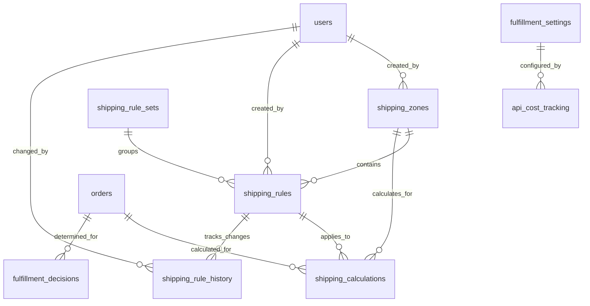

# Database Schema Design: Smart Shipping System

## Overview

This document provides comprehensive database schema specifications for the zone-based shipping system, including tables, relationships, indexes, constraints, and migration strategies.

## Schema Architecture

### Design Principles
1. **Flexibility**: Support multiple zones, rule sets, and future courier integrations
2. **Performance**: Optimized for fast shipping calculations and reporting
3. **Auditability**: Complete audit trail for all shipping rule changes
4. **Scalability**: Designed to handle high-volume e-commerce operations
5. **Data Integrity**: Comprehensive constraints and validation rules

### Entity Relationship Diagram



## Core Tables

### 1. shipping_zones

**Purpose**: Defines geographic shipping zones with state groupings and multipliers.

```sql
CREATE TABLE shipping_zones (
  id UUID PRIMARY KEY DEFAULT gen_random_uuid(),
  name VARCHAR(100) NOT NULL, -- 'Peninsular Malaysia', 'East Malaysia'
  code VARCHAR(20) UNIQUE NOT NULL, -- 'PENINSULAR', 'EAST_MALAYSIA'
  description TEXT,
  states TEXT[] NOT NULL, -- PostgreSQL array: ['JOH','KDH','KTN',...]
  postcode_ranges TEXT[], -- Optional: ['50xxx','51xxx'] for specific postcodes
  multiplier DECIMAL(4,2) NOT NULL DEFAULT 1.0, -- Rate multiplier: 1.0, 1.5, 2.0
  delivery_time_min INTEGER DEFAULT 1, -- Minimum delivery days
  delivery_time_max INTEGER DEFAULT 7, -- Maximum delivery days
  is_active BOOLEAN NOT NULL DEFAULT true,
  sort_order INTEGER NOT NULL DEFAULT 0,
  features JSONB, -- Zone-specific features: {"same_day": true, "cod": true}
  created_at TIMESTAMP NOT NULL DEFAULT NOW(),
  updated_at TIMESTAMP NOT NULL DEFAULT NOW(),
  created_by UUID REFERENCES users(id),
  updated_by UUID REFERENCES users(id),
  
  -- Constraints
  CONSTRAINT multiplier_positive CHECK (multiplier > 0),
  CONSTRAINT delivery_time_valid CHECK (delivery_time_max >= delivery_time_min),
  CONSTRAINT states_not_empty CHECK (array_length(states, 1) > 0)
);

-- Indexes for performance
CREATE INDEX idx_shipping_zones_active_sort ON shipping_zones(is_active, sort_order);
CREATE INDEX idx_shipping_zones_states_gin ON shipping_zones USING GIN(states);
CREATE INDEX idx_shipping_zones_postcode_gin ON shipping_zones USING GIN(postcode_ranges);
CREATE INDEX idx_shipping_zones_code ON shipping_zones(code) WHERE is_active = true;

-- Comments
COMMENT ON TABLE shipping_zones IS 'Geographic zones for shipping rate calculation';
COMMENT ON COLUMN shipping_zones.states IS 'Array of Malaysian state codes (JOH, KDH, etc.)';
COMMENT ON COLUMN shipping_zones.multiplier IS 'Rate multiplier applied to base shipping costs';
COMMENT ON COLUMN shipping_zones.features IS 'JSON object storing zone-specific capabilities';
```

### 2. shipping_rule_sets

**Purpose**: Groups shipping rules for different scenarios (standard, promotional, seasonal).

```sql
CREATE TABLE shipping_rule_sets (
  id UUID PRIMARY KEY DEFAULT gen_random_uuid(),
  name VARCHAR(100) NOT NULL, -- 'Standard Rates', 'Holiday Promotion', 'Peak Season'
  description TEXT,
  rule_type VARCHAR(20) NOT NULL DEFAULT 'STANDARD', -- 'STANDARD', 'PROMOTIONAL', 'SEASONAL'
  is_default BOOLEAN NOT NULL DEFAULT false,
  is_active BOOLEAN NOT NULL DEFAULT true,
  priority INTEGER NOT NULL DEFAULT 0, -- Higher number = higher priority
  valid_from TIMESTAMP NOT NULL DEFAULT NOW(),
  valid_to TIMESTAMP, -- NULL means no expiry
  conditions JSONB, -- Rule activation conditions
  created_at TIMESTAMP NOT NULL DEFAULT NOW(),
  updated_at TIMESTAMP NOT NULL DEFAULT NOW(),
  created_by UUID REFERENCES users(id),
  
  -- Constraints
  CONSTRAINT single_default_rule_set EXCLUDE (is_default WITH =) WHERE (is_default = true AND is_active = true),
  CONSTRAINT valid_date_range CHECK (valid_to IS NULL OR valid_to > valid_from),
  CONSTRAINT rule_type_valid CHECK (rule_type IN ('STANDARD', 'PROMOTIONAL', 'SEASONAL', 'EMERGENCY'))
);

-- Indexes
CREATE INDEX idx_shipping_rule_sets_active_default ON shipping_rule_sets(is_active, is_default);
CREATE INDEX idx_shipping_rule_sets_validity ON shipping_rule_sets(valid_from, valid_to) WHERE is_active = true;
CREATE INDEX idx_shipping_rule_sets_priority ON shipping_rule_sets(priority DESC) WHERE is_active = true;

-- Comments
COMMENT ON TABLE shipping_rule_sets IS 'Logical groupings of shipping rules for different scenarios';
COMMENT ON COLUMN shipping_rule_sets.conditions IS 'JSON conditions for automatic rule set activation';
```

### 3. shipping_rules

**Purpose**: Defines weight-based shipping rates for each zone and rule set.

```sql
CREATE TABLE shipping_rules (
  id UUID PRIMARY KEY DEFAULT gen_random_uuid(),
  zone_id UUID NOT NULL REFERENCES shipping_zones(id) ON DELETE CASCADE,
  rule_set_id UUID NOT NULL REFERENCES shipping_rule_sets(id) ON DELETE CASCADE,
  weight_min DECIMAL(6,3) NOT NULL, -- 0.000 kg
  weight_max DECIMAL(6,3) NOT NULL, -- 999.999 kg
  price DECIMAL(8,2) NOT NULL, -- RM 0.00
  currency CHAR(3) NOT NULL DEFAULT 'MYR',
  service_type VARCHAR(20) DEFAULT 'STANDARD', -- 'STANDARD', 'EXPRESS', 'OVERNIGHT'
  description VARCHAR(200), -- 'Standard delivery for small items'
  is_active BOOLEAN NOT NULL DEFAULT true,
  effective_from TIMESTAMP NOT NULL DEFAULT NOW(),
  effective_to TIMESTAMP, -- NULL means no expiry
  metadata JSONB, -- Additional rule metadata
  created_at TIMESTAMP NOT NULL DEFAULT NOW(),
  updated_at TIMESTAMP NOT NULL DEFAULT NOW(),
  created_by UUID REFERENCES users(id),
  updated_by UUID REFERENCES users(id),
  
  -- Constraints
  CONSTRAINT weight_min_positive CHECK (weight_min >= 0),
  CONSTRAINT weight_max_greater CHECK (weight_max > weight_min),
  CONSTRAINT price_positive CHECK (price >= 0),
  CONSTRAINT effective_date_range CHECK (effective_to IS NULL OR effective_to > effective_from),
  CONSTRAINT unique_zone_weight_rule UNIQUE (zone_id, rule_set_id, weight_min, weight_max, service_type),
  CONSTRAINT service_type_valid CHECK (service_type IN ('STANDARD', 'EXPRESS', 'OVERNIGHT', 'ECONOMY'))
);

-- Indexes for fast shipping calculations
CREATE INDEX idx_shipping_rules_zone_weight ON shipping_rules(zone_id, weight_min, weight_max) WHERE is_active = true;
CREATE INDEX idx_shipping_rules_ruleset_active ON shipping_rules(rule_set_id, is_active, effective_from, effective_to);
CREATE INDEX idx_shipping_rules_calculation_lookup ON shipping_rules(zone_id, rule_set_id, weight_min, weight_max, is_active);
CREATE INDEX idx_shipping_rules_service_type ON shipping_rules(service_type) WHERE is_active = true;

-- Comments
COMMENT ON TABLE shipping_rules IS 'Weight-based shipping rates for specific zones and rule sets';
COMMENT ON COLUMN shipping_rules.metadata IS 'Additional rule properties like handling fees, restrictions';
```

## Audit and Analytics Tables

### 4. shipping_rule_history

**Purpose**: Complete audit trail of all shipping rule changes.

```sql
CREATE TABLE shipping_rule_history (
  id UUID PRIMARY KEY DEFAULT gen_random_uuid(),
  rule_id UUID NOT NULL, -- May reference deleted rules
  zone_id UUID NOT NULL,
  rule_set_id UUID NOT NULL,
  operation VARCHAR(20) NOT NULL, -- 'CREATE', 'UPDATE', 'DELETE', 'ACTIVATE', 'DEACTIVATE'
  
  -- Previous values (for UPDATE operations)
  old_values JSONB,
  
  -- New values
  new_values JSONB NOT NULL,
  
  -- Change metadata
  change_reason TEXT,
  change_description TEXT,
  user_id UUID REFERENCES users(id),
  user_ip INET,
  user_agent TEXT,
  
  -- Timing
  created_at TIMESTAMP NOT NULL DEFAULT NOW(),
  
  -- Constraints
  CONSTRAINT operation_valid CHECK (operation IN ('CREATE', 'UPDATE', 'DELETE', 'ACTIVATE', 'DEACTIVATE', 'BULK_UPDATE'))
);

-- Indexes for audit queries
CREATE INDEX idx_shipping_rule_history_rule ON shipping_rule_history(rule_id, created_at DESC);
CREATE INDEX idx_shipping_rule_history_user ON shipping_rule_history(user_id, created_at DESC);
CREATE INDEX idx_shipping_rule_history_operation ON shipping_rule_history(operation, created_at DESC);
CREATE INDEX idx_shipping_rule_history_zone ON shipping_rule_history(zone_id, created_at DESC);

-- Comments
COMMENT ON TABLE shipping_rule_history IS 'Complete audit trail of shipping rule modifications';
COMMENT ON COLUMN shipping_rule_history.old_values IS 'Previous rule values in JSON format';
COMMENT ON COLUMN shipping_rule_history.new_values IS 'Updated rule values in JSON format';
```

### 5. shipping_calculations

**Purpose**: Records all shipping calculations for analytics and troubleshooting.

```sql
CREATE TABLE shipping_calculations (
  id UUID PRIMARY KEY DEFAULT gen_random_uuid(),
  order_id UUID, -- Optional: link to actual order
  session_id VARCHAR(255), -- For guest checkout calculations
  
  -- Calculation inputs
  customer_state CHAR(3) NOT NULL,
  customer_city VARCHAR(100),
  customer_postcode VARCHAR(10),
  total_weight DECIMAL(6,3) NOT NULL,
  order_value DECIMAL(10,2) NOT NULL,
  item_count INTEGER NOT NULL,
  
  -- Calculation results
  zone_id UUID NOT NULL REFERENCES shipping_zones(id),
  rule_id UUID NOT NULL REFERENCES shipping_rules(id),
  rule_set_id UUID NOT NULL REFERENCES shipping_rule_sets(id),
  base_price DECIMAL(8,2) NOT NULL,
  final_price DECIMAL(8,2) NOT NULL,
  discount_applied DECIMAL(8,2) DEFAULT 0,
  free_shipping_applied BOOLEAN DEFAULT false,
  
  -- Calculation metadata
  calculation_method VARCHAR(20) DEFAULT 'STANDARD', -- 'STANDARD', 'FALLBACK', 'EMERGENCY'
  calculation_data JSONB, -- Full calculation details
  response_time_ms INTEGER,
  
  -- User context
  user_id UUID REFERENCES users(id), -- NULL for guest users
  user_type VARCHAR(20), -- 'GUEST', 'MEMBER', 'VIP'
  
  -- Timing
  created_at TIMESTAMP NOT NULL DEFAULT NOW(),
  
  -- Constraints
  CONSTRAINT weight_positive CHECK (total_weight > 0),
  CONSTRAINT order_value_positive CHECK (order_value >= 0),
  CONSTRAINT item_count_positive CHECK (item_count > 0),
  CONSTRAINT prices_valid CHECK (final_price >= 0 AND base_price >= 0),
  CONSTRAINT discount_valid CHECK (discount_applied >= 0),
  CONSTRAINT calculation_method_valid CHECK (calculation_method IN ('STANDARD', 'FALLBACK', 'EMERGENCY', 'CACHED'))
);

-- Indexes for analytics
CREATE INDEX idx_shipping_calculations_zone_date ON shipping_calculations(zone_id, created_at);
CREATE INDEX idx_shipping_calculations_price_analysis ON shipping_calculations(base_price, final_price, created_at);
CREATE INDEX idx_shipping_calculations_order ON shipping_calculations(order_id) WHERE order_id IS NOT NULL;
CREATE INDEX idx_shipping_calculations_user_analytics ON shipping_calculations(user_type, created_at);
CREATE INDEX idx_shipping_calculations_free_shipping ON shipping_calculations(free_shipping_applied, created_at);

-- Partitioning for performance (monthly partitions)
-- CREATE TABLE shipping_calculations_y2024m01 PARTITION OF shipping_calculations
-- FOR VALUES FROM ('2024-01-01') TO ('2024-02-01');

-- Comments
COMMENT ON TABLE shipping_calculations IS 'Historical record of all shipping rate calculations';
COMMENT ON COLUMN shipping_calculations.calculation_data IS 'Complete calculation breakdown in JSON format';
```

## Fulfillment System Tables

### 6. fulfillment_settings

**Purpose**: Configuration for API/CSV hybrid fulfillment system.

```sql
CREATE TABLE fulfillment_settings (
  id UUID PRIMARY KEY DEFAULT gen_random_uuid(),
  setting_name VARCHAR(100) UNIQUE NOT NULL,
  setting_value JSONB NOT NULL,
  setting_type VARCHAR(50) NOT NULL, -- 'API_CONFIG', 'CSV_CONFIG', 'DECISION_RULES', 'COST_LIMITS'
  description TEXT,
  is_active BOOLEAN NOT NULL DEFAULT true,
  effective_from TIMESTAMP NOT NULL DEFAULT NOW(),
  effective_to TIMESTAMP,
  created_at TIMESTAMP NOT NULL DEFAULT NOW(),
  updated_at TIMESTAMP NOT NULL DEFAULT NOW(),
  created_by UUID REFERENCES users(id),
  updated_by UUID REFERENCES users(id),
  
  -- Constraints
  CONSTRAINT setting_type_valid CHECK (setting_type IN ('API_CONFIG', 'CSV_CONFIG', 'DECISION_RULES', 'COST_LIMITS', 'ALERT_SETTINGS')),
  CONSTRAINT effective_date_range CHECK (effective_to IS NULL OR effective_to > effective_from)
);

-- Example settings data
INSERT INTO fulfillment_settings (setting_name, setting_value, setting_type, description) VALUES
('api_health_thresholds', '{
  "response_time_warning": 5000,
  "response_time_critical": 10000,
  "success_rate_warning": 90,
  "success_rate_critical": 80,
  "consecutive_failures_limit": 5
}', 'API_CONFIG', 'API health monitoring thresholds'),

('csv_batch_settings', '{
  "max_orders_per_batch": 100,
  "batch_timeout_minutes": 30,
  "auto_notification": true,
  "priority_processing": ["EXPRESS", "VIP"]
}', 'CSV_CONFIG', 'CSV batch processing configuration'),

('cost_management', '{
  "monthly_api_budget": 1000,
  "cost_per_api_call": 0.50,
  "budget_warning_percentage": 80,
  "budget_critical_percentage": 95
}', 'COST_LIMITS', 'API cost management settings');

-- Indexes
CREATE INDEX idx_fulfillment_settings_type_active ON fulfillment_settings(setting_type, is_active);
CREATE INDEX idx_fulfillment_settings_effective ON fulfillment_settings(effective_from, effective_to) WHERE is_active = true;

-- Comments
COMMENT ON TABLE fulfillment_settings IS 'Configuration settings for the hybrid fulfillment system';
```

### 7. fulfillment_decisions

**Purpose**: Records API vs CSV routing decisions for analysis.

```sql
CREATE TABLE fulfillment_decisions (
  id UUID PRIMARY KEY DEFAULT gen_random_uuid(),
  order_ids UUID[] NOT NULL, -- Array of order IDs in this decision
  decision_method VARCHAR(20) NOT NULL, -- 'API', 'CSV'
  decision_reason VARCHAR(100) NOT NULL, -- 'API_HEALTHY', 'BULK_PROCESSING', 'API_DOWN', etc.
  
  -- Decision context
  order_count INTEGER NOT NULL,
  total_value DECIMAL(10,2) NOT NULL,
  priority_distribution JSONB, -- Count by priority: {"EXPRESS": 5, "STANDARD": 15}
  api_health_status VARCHAR(20), -- 'HEALTHY', 'DEGRADED', 'DOWN'
  current_api_budget_usage DECIMAL(5,2), -- Percentage
  
  -- Decision outcome
  processing_started_at TIMESTAMP,
  processing_completed_at TIMESTAMP,
  success_count INTEGER DEFAULT 0,
  failure_count INTEGER DEFAULT 0,
  
  -- Performance metrics
  total_processing_time_ms INTEGER,
  average_processing_time_ms INTEGER,
  cost_estimate DECIMAL(8,2),
  actual_cost DECIMAL(8,2),
  
  -- Metadata
  decision_data JSONB, -- Full decision context
  created_at TIMESTAMP NOT NULL DEFAULT NOW(),
  
  -- Constraints
  CONSTRAINT decision_method_valid CHECK (decision_method IN ('API', 'CSV', 'HYBRID')),
  CONSTRAINT order_count_positive CHECK (order_count > 0),
  CONSTRAINT total_value_positive CHECK (total_value >= 0),
  CONSTRAINT budget_usage_valid CHECK (current_api_budget_usage >= 0 AND current_api_budget_usage <= 100)
);

-- Indexes for analysis
CREATE INDEX idx_fulfillment_decisions_method_date ON fulfillment_decisions(decision_method, created_at);
CREATE INDEX idx_fulfillment_decisions_reason ON fulfillment_decisions(decision_reason, created_at);
CREATE INDEX idx_fulfillment_decisions_performance ON fulfillment_decisions(total_processing_time_ms, order_count);
CREATE INDEX idx_fulfillment_decisions_cost_analysis ON fulfillment_decisions(cost_estimate, actual_cost, created_at);

-- Comments
COMMENT ON TABLE fulfillment_decisions IS 'Historical record of API vs CSV routing decisions';
COMMENT ON COLUMN fulfillment_decisions.decision_data IS 'Complete decision context and parameters';
```

### 8. api_cost_tracking

**Purpose**: Tracks API usage and costs for budget management.

```sql
CREATE TABLE api_cost_tracking (
  id UUID PRIMARY KEY DEFAULT gen_random_uuid(),
  api_provider VARCHAR(50) NOT NULL, -- 'EASYPARCEL', 'ALTERNATIVE_COURIER'
  operation_type VARCHAR(50) NOT NULL, -- 'RATE_CALCULATION', 'SHIPMENT_CREATION', 'TRACKING_UPDATE'
  
  -- Call details
  endpoint VARCHAR(200),
  http_method VARCHAR(10),
  request_size_bytes INTEGER,
  response_size_bytes INTEGER,
  
  -- Performance metrics
  response_time_ms INTEGER NOT NULL,
  status_code INTEGER NOT NULL,
  success BOOLEAN NOT NULL,
  error_message TEXT,
  
  -- Cost information
  cost_amount DECIMAL(8,4) NOT NULL, -- Precise cost tracking
  cost_currency CHAR(3) NOT NULL DEFAULT 'MYR',
  billing_unit VARCHAR(20), -- 'PER_CALL', 'PER_KB', 'PER_SHIPMENT'
  
  -- Context
  order_id UUID, -- Associated order if applicable
  user_id UUID REFERENCES users(id),
  session_id VARCHAR(255),
  
  -- Metadata
  request_data JSONB, -- Sanitized request data (no sensitive info)
  response_summary JSONB, -- Key response data
  
  -- Timing
  created_at TIMESTAMP NOT NULL DEFAULT NOW(),
  
  -- Constraints
  CONSTRAINT response_time_positive CHECK (response_time_ms >= 0),
  CONSTRAINT cost_positive CHECK (cost_amount >= 0),
  CONSTRAINT status_code_valid CHECK (status_code BETWEEN 100 AND 599),
  CONSTRAINT operation_type_valid CHECK (operation_type IN ('RATE_CALCULATION', 'SHIPMENT_CREATION', 'TRACKING_UPDATE', 'HEALTH_CHECK', 'AUTHENTICATION'))
);

-- Indexes for cost analysis
CREATE INDEX idx_api_cost_tracking_provider_date ON api_cost_tracking(api_provider, created_at);
CREATE INDEX idx_api_cost_tracking_operation_cost ON api_cost_tracking(operation_type, cost_amount, created_at);
CREATE INDEX idx_api_cost_tracking_monthly_cost ON api_cost_tracking(DATE_TRUNC('month', created_at), cost_amount);
CREATE INDEX idx_api_cost_tracking_performance ON api_cost_tracking(response_time_ms, success, created_at);

-- Partitioning for performance (monthly partitions recommended)
-- CREATE TABLE api_cost_tracking_y2024m01 PARTITION OF api_cost_tracking
-- FOR VALUES FROM ('2024-01-01') TO ('2024-02-01');

-- Comments
COMMENT ON TABLE api_cost_tracking IS 'Detailed tracking of API usage and associated costs';
COMMENT ON COLUMN api_cost_tracking.request_data IS 'Sanitized request data for debugging (no credentials)';
```

## Performance Optimization

### Materialized Views

#### 1. Zone State Lookup (Fast shipping calculation)
```sql
CREATE MATERIALIZED VIEW shipping_zone_state_lookup AS
SELECT 
  sz.id as zone_id,
  sz.name as zone_name,
  sz.code as zone_code,
  sz.multiplier,
  sz.delivery_time_min,
  sz.delivery_time_max,
  unnest(sz.states) as state_code
FROM shipping_zones sz
WHERE sz.is_active = true;

-- Unique index for instant lookups
CREATE UNIQUE INDEX idx_zone_state_lookup_state ON shipping_zone_state_lookup(state_code);
CREATE INDEX idx_zone_state_lookup_zone ON shipping_zone_state_lookup(zone_id);

-- Auto-refresh on zone changes
CREATE OR REPLACE FUNCTION refresh_zone_lookup()
RETURNS TRIGGER AS $$
BEGIN
  REFRESH MATERIALIZED VIEW CONCURRENTLY shipping_zone_state_lookup;
  RETURN NULL;
END;
$$ LANGUAGE plpgsql;

CREATE TRIGGER trigger_refresh_zone_lookup
  AFTER INSERT OR UPDATE OR DELETE ON shipping_zones
  FOR EACH STATEMENT
  EXECUTE FUNCTION refresh_zone_lookup();
```

#### 2. Current Shipping Rates (Active rules only)
```sql
CREATE MATERIALIZED VIEW current_shipping_rates AS
SELECT 
  sr.id,
  sr.zone_id,
  sz.name as zone_name,
  sz.code as zone_code,
  sr.rule_set_id,
  srs.name as rule_set_name,
  sr.weight_min,
  sr.weight_max,
  sr.price,
  sr.service_type,
  sz.multiplier,
  (sr.price * sz.multiplier) as final_price
FROM shipping_rules sr
JOIN shipping_zones sz ON sr.zone_id = sz.id
JOIN shipping_rule_sets srs ON sr.rule_set_id = srs.id
WHERE sr.is_active = true 
  AND sz.is_active = true
  AND srs.is_active = true
  AND (sr.effective_to IS NULL OR sr.effective_to > NOW())
  AND (srs.valid_to IS NULL OR srs.valid_to > NOW());

-- Indexes for fast rate lookup
CREATE INDEX idx_current_rates_zone_weight ON current_shipping_rates(zone_id, weight_min, weight_max);
CREATE INDEX idx_current_rates_service_type ON current_shipping_rates(service_type);

-- Auto-refresh on rule changes
CREATE OR REPLACE FUNCTION refresh_current_rates()
RETURNS TRIGGER AS $$
BEGIN
  REFRESH MATERIALIZED VIEW CONCURRENTLY current_shipping_rates;
  RETURN NULL;
END;
$$ LANGUAGE plpgsql;

CREATE TRIGGER trigger_refresh_rates_rules
  AFTER INSERT OR UPDATE OR DELETE ON shipping_rules
  FOR EACH STATEMENT
  EXECUTE FUNCTION refresh_current_rates();

CREATE TRIGGER trigger_refresh_rates_zones
  AFTER UPDATE ON shipping_zones
  FOR EACH STATEMENT
  EXECUTE FUNCTION refresh_current_rates();
```

### Custom Functions

#### 1. Fast Shipping Calculation
```sql
CREATE OR REPLACE FUNCTION calculate_shipping_rate(
  p_state_code CHAR(3),
  p_weight DECIMAL(6,3),
  p_order_value DECIMAL(10,2) DEFAULT 0,
  p_rule_set_id UUID DEFAULT NULL
)
RETURNS TABLE (
  zone_id UUID,
  zone_name VARCHAR(100),
  rule_id UUID,
  base_price DECIMAL(8,2),
  final_price DECIMAL(8,2),
  delivery_days_min INTEGER,
  delivery_days_max INTEGER
) AS $$
DECLARE
  v_zone_id UUID;
  v_multiplier DECIMAL(4,2);
  v_delivery_min INTEGER;
  v_delivery_max INTEGER;
  v_zone_name VARCHAR(100);
  v_rule_id UUID;
  v_base_price DECIMAL(8,2);
  v_final_price DECIMAL(8,2);
  v_free_shipping_threshold DECIMAL(10,2) := 150.00; -- Default threshold
BEGIN
  -- Find zone by state
  SELECT zsl.zone_id, zsl.zone_name, zsl.multiplier, zsl.delivery_time_min, zsl.delivery_time_max
  INTO v_zone_id, v_zone_name, v_multiplier, v_delivery_min, v_delivery_max
  FROM shipping_zone_state_lookup zsl
  WHERE zsl.state_code = p_state_code;
  
  IF v_zone_id IS NULL THEN
    RAISE EXCEPTION 'No shipping zone found for state: %', p_state_code;
  END IF;
  
  -- Find appropriate shipping rule
  SELECT cr.id, cr.price
  INTO v_rule_id, v_base_price
  FROM current_shipping_rates cr
  WHERE cr.zone_id = v_zone_id
    AND p_weight >= cr.weight_min 
    AND p_weight <= cr.weight_max
    AND (p_rule_set_id IS NULL OR cr.rule_set_id = p_rule_set_id)
  ORDER BY cr.weight_min DESC -- Most specific rule first
  LIMIT 1;
  
  IF v_rule_id IS NULL THEN
    RAISE EXCEPTION 'No shipping rule found for zone % and weight %kg', v_zone_name, p_weight;
  END IF;
  
  -- Calculate final price with zone multiplier
  v_final_price := v_base_price * v_multiplier;
  
  -- Apply free shipping if threshold met
  IF p_order_value >= v_free_shipping_threshold THEN
    v_final_price := 0;
  END IF;
  
  -- Return results
  RETURN QUERY SELECT 
    v_zone_id,
    v_zone_name,
    v_rule_id,
    v_base_price,
    v_final_price,
    v_delivery_min,
    v_delivery_max;
END;
$$ LANGUAGE plpgsql STABLE;

-- Usage example:
-- SELECT * FROM calculate_shipping_rate('JOH', 1.5, 100.00);
```

#### 2. Bulk Rate Update Function
```sql
CREATE OR REPLACE FUNCTION bulk_update_shipping_rates(
  p_zone_ids UUID[],
  p_weight_min DECIMAL(6,3),
  p_weight_max DECIMAL(6,3),
  p_adjustment_type VARCHAR(20), -- 'PERCENTAGE', 'FLAT_AMOUNT', 'SET_PRICE'
  p_adjustment_value DECIMAL(8,2),
  p_user_id UUID
)
RETURNS INTEGER AS $$
DECLARE
  v_updated_count INTEGER := 0;
  v_rule_record RECORD;
  v_new_price DECIMAL(8,2);
BEGIN
  -- Validate adjustment type
  IF p_adjustment_type NOT IN ('PERCENTAGE', 'FLAT_AMOUNT', 'SET_PRICE') THEN
    RAISE EXCEPTION 'Invalid adjustment type: %', p_adjustment_type;
  END IF;
  
  -- Update rules and track changes
  FOR v_rule_record IN 
    SELECT id, price, zone_id
    FROM shipping_rules
    WHERE zone_id = ANY(p_zone_ids)
      AND weight_min >= p_weight_min
      AND weight_max <= p_weight_max
      AND is_active = true
  LOOP
    -- Calculate new price based on adjustment type
    CASE p_adjustment_type
      WHEN 'PERCENTAGE' THEN
        v_new_price := v_rule_record.price * (1 + p_adjustment_value / 100);
      WHEN 'FLAT_AMOUNT' THEN
        v_new_price := v_rule_record.price + p_adjustment_value;
      WHEN 'SET_PRICE' THEN
        v_new_price := p_adjustment_value;
    END CASE;
    
    -- Ensure price is not negative
    v_new_price := GREATEST(v_new_price, 0);
    
    -- Update the rule
    UPDATE shipping_rules
    SET price = v_new_price,
        updated_at = NOW(),
        updated_by = p_user_id
    WHERE id = v_rule_record.id;
    
    -- Log the change
    INSERT INTO shipping_rule_history (
      rule_id, zone_id, operation, old_values, new_values, 
      change_reason, user_id, created_at
    ) VALUES (
      v_rule_record.id, v_rule_record.zone_id, 'BULK_UPDATE',
      jsonb_build_object('price', v_rule_record.price),
      jsonb_build_object('price', v_new_price),
      format('Bulk %s adjustment: %s', p_adjustment_type, p_adjustment_value),
      p_user_id, NOW()
    );
    
    v_updated_count := v_updated_count + 1;
  END LOOP;
  
  RETURN v_updated_count;
END;
$$ LANGUAGE plpgsql;

-- Usage example:
-- SELECT bulk_update_shipping_rates(
--   ARRAY['zone-uuid-1', 'zone-uuid-2'], 0, 5, 'PERCENTAGE', 10, 'user-uuid'
-- );
```

## Data Migration Strategy

### Migration from Current System

```sql
-- 1. Create backup of existing data
CREATE TABLE shipping_migration_backup AS
SELECT * FROM orders WHERE created_at >= '2024-01-01';

-- 2. Create default zones based on current logic
INSERT INTO shipping_zones (name, code, states, multiplier, created_by) VALUES
('Peninsular Malaysia', 'PENINSULAR', 
 ARRAY['JOH','KDH','KTN','MLK','NSN','PHG','PRK','PLS','PNG','KUL','TRG','SEL'], 
 1.0, 'system-migration'),
('East Malaysia', 'EAST_MALAYSIA', 
 ARRAY['SBH','SWK','LBN'], 
 1.875, 'system-migration'); -- 15/8 = 1.875 multiplier

-- 3. Create default rule set
INSERT INTO shipping_rule_sets (name, description, is_default, created_by) VALUES
('Standard Rates', 'Default shipping rates migrated from flat rate system', true, 'system-migration');

-- 4. Create rules based on current flat rates
WITH zones AS (
  SELECT id, code FROM shipping_zones WHERE code IN ('PENINSULAR', 'EAST_MALAYSIA')
),
rule_set AS (
  SELECT id FROM shipping_rule_sets WHERE is_default = true
)
INSERT INTO shipping_rules (zone_id, rule_set_id, weight_min, weight_max, price, created_by)
SELECT 
  z.id,
  rs.id,
  CASE weight_band
    WHEN 1 THEN 0 WHEN 2 THEN 1 WHEN 3 THEN 2 WHEN 4 THEN 3 WHEN 5 THEN 5
  END as weight_min,
  CASE weight_band
    WHEN 1 THEN 1 WHEN 2 THEN 2 WHEN 3 THEN 3 WHEN 4 THEN 5 WHEN 5 THEN 999
  END as weight_max,
  CASE 
    WHEN z.code = 'PENINSULAR' THEN
      CASE weight_band WHEN 1 THEN 5.00 WHEN 2 THEN 7.00 WHEN 3 THEN 9.00 WHEN 4 THEN 12.00 WHEN 5 THEN 15.00 END
    WHEN z.code = 'EAST_MALAYSIA' THEN
      CASE weight_band WHEN 1 THEN 8.00 WHEN 2 THEN 10.67 WHEN 3 THEN 13.33 WHEN 4 THEN 16.00 WHEN 5 THEN 20.00 END
  END as price,
  'system-migration'
FROM zones z
CROSS JOIN rule_set rs
CROSS JOIN generate_series(1, 5) as weight_band;

-- 5. Migrate historical shipping calculations (if needed)
INSERT INTO shipping_calculations (
  order_id, customer_state, total_weight, order_value, item_count,
  zone_id, rule_id, base_price, final_price, created_at
)
SELECT 
  o.id,
  o.shipping_state,
  COALESCE(o.total_weight, 1.0),
  o.total_amount,
  o.item_count,
  z.id,
  sr.id,
  o.shipping_cost,
  o.shipping_cost,
  o.created_at
FROM orders o
JOIN shipping_zone_state_lookup zsl ON o.shipping_state = zsl.state_code
JOIN shipping_zones z ON zsl.zone_id = z.id
JOIN shipping_rules sr ON z.id = sr.zone_id
WHERE o.created_at >= '2024-01-01'
  AND sr.weight_min <= COALESCE(o.total_weight, 1.0)
  AND sr.weight_max >= COALESCE(o.total_weight, 1.0);
```

## Backup and Recovery

### Backup Strategy
```sql
-- 1. Daily backup script
pg_dump --host=localhost --username=postgres --dbname=ecomjrm \
        --table=shipping_zones \
        --table=shipping_rules \
        --table=shipping_rule_sets \
        --table=shipping_rule_history \
        --table=fulfillment_settings \
        --format=custom \
        --file=shipping_backup_$(date +%Y%m%d).backup

-- 2. Point-in-time recovery setup
-- Enable WAL archiving in postgresql.conf:
-- wal_level = replica
-- archive_mode = on
-- archive_command = 'cp %p /backup/wal/%f'

-- 3. Hot standby configuration for read replicas
-- Set up streaming replication for read-only analytics queries
```

### Recovery Procedures
```sql
-- 1. Restore from backup
pg_restore --host=localhost --username=postgres --dbname=ecomjrm \
           --verbose shipping_backup_20241201.backup

-- 2. Verify data integrity
SELECT 
  COUNT(*) as total_zones,
  COUNT(CASE WHEN is_active THEN 1 END) as active_zones
FROM shipping_zones;

SELECT 
  COUNT(*) as total_rules,
  COUNT(CASE WHEN is_active THEN 1 END) as active_rules
FROM shipping_rules;

-- 3. Refresh materialized views
REFRESH MATERIALIZED VIEW CONCURRENTLY shipping_zone_state_lookup;
REFRESH MATERIALIZED VIEW CONCURRENTLY current_shipping_rates;
```

This comprehensive database schema provides a robust foundation for the smart shipping system, ensuring data integrity, performance, and scalability while maintaining complete audit trails and supporting advanced analytics.