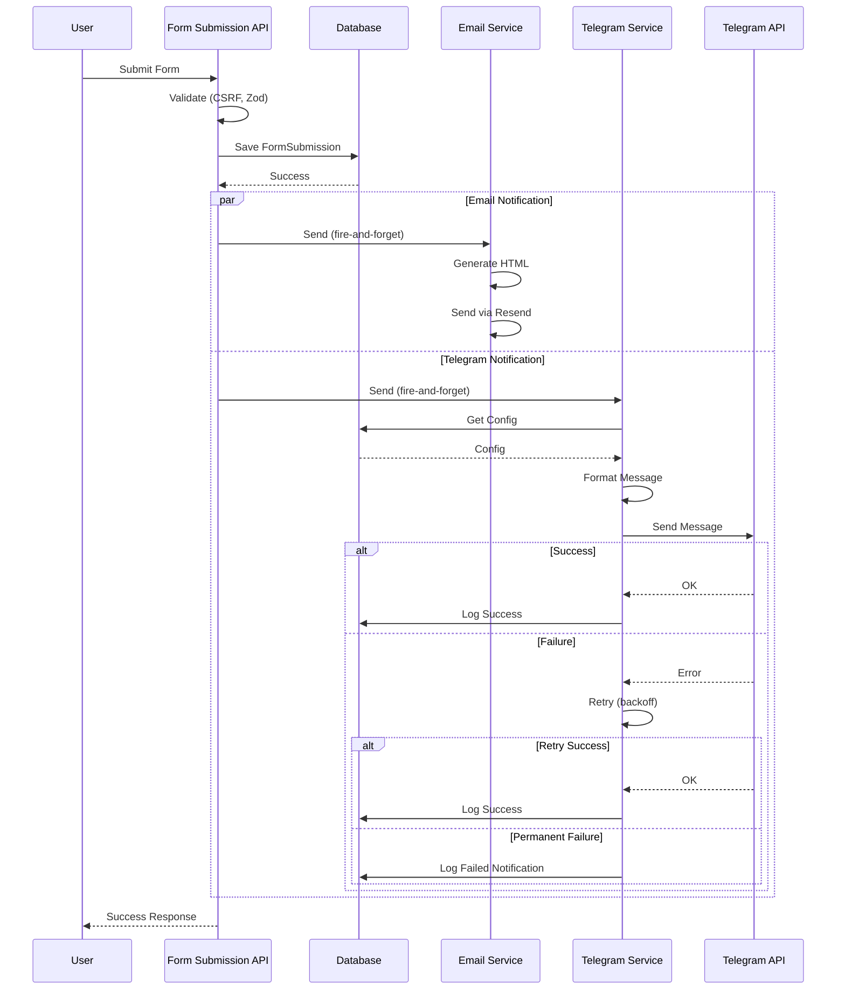

# Telegram Notification Integration Plan for Form Submissions

**Document Version**: 1.0
**Date**: 02 December 2025
**Status**: Planning Complete - Ready for Implementation
**Author**: Development Team

---

## Table of Contents

1. [Executive Summary](#executive-summary)
2. [Analysis Summary](#analysis-summary)
3. [Recommended Architecture](#recommended-architecture)
4. [Implementation Plan](#implementation-plan)
5. [Security Considerations](#security-considerations)
6. [Performance Optimization](#performance-optimization)
7. [Testing Strategy](#testing-strategy)
8. [File Structure](#file-structure)
9. [Implementation Sequence](#implementation-sequence)
10. [Message Formatting Examples](#message-formatting-examples)
11. [Potential Challenges & Solutions](#potential-challenges--solutions)
12. [Success Metrics](#success-metrics)
13. [Rollback Strategy](#rollback-strategy)
14. [Documentation Needs](#documentation-needs)
15. [Completion Checklist](#completion-checklist)

---

## Executive Summary

### Objective

Integrate Telegram notifications for all form submissions received through click pages (landing pages), providing real-time alerts to administrators for immediate follow-up on leads.

### Key Goals

- ✅ Real-time notification delivery to Telegram
- ✅ Leverage existing notification infrastructure
- ✅ Follow coding standards (DRY, Single Source of Truth, No Hardcoding)
- ✅ Non-blocking execution (no impact on form submission UX)
- ✅ Comprehensive error handling and retry logic
- ✅ Admin-configurable settings via UI

### Approach

Extend the existing `SimplifiedTelegramService` (currently handling Orders, Inventory, Chat, System Alerts) to add a new "Form Submissions" channel. This maintains architectural consistency and follows established patterns.

---

## Analysis Summary

### Existing Infrastructure (Strengths to Leverage)

#### ✅ Robust Telegram Service (`SimplifiedTelegramService`)

**Location**: `/src/lib/telegram/simplified-telegram-service.ts`

**Features**:
- Database-driven configuration (no environment variables)
- Multi-channel support (Orders, Inventory, Chat Management, System Alerts)
- Retry queue with exponential backoff (up to 3 retries)
- Health monitoring every 5 minutes
- HTML/Markdown formatting support
- Idempotent message handling
- Automatic configuration reload

**Configuration Model**: `AdminTelegramConfig`
- Single active configuration per system
- Per-channel enable/disable flags
- Bot token and chat IDs stored in database
- Centrally managed by admin

#### ✅ Well-Structured Form Submission Flow

**Location**: `/src/app/api/public/click-pages/[slug]/forms/submit/route.ts`

**Current Features**:
- CSRF-protected API endpoint
- Email notifications already working (fire-and-forget pattern)
- Comprehensive data validation with Zod
- FormSubmission database model with full audit trail
- IP address and user agent capture
- Environment capture for security

**Database Model**: `FormSubmission`
```prisma
model FormSubmission {
  id          String   @id @default(cuid())
  clickPageId String
  blockId     String    // Which FORM block was submitted
  data        Json      // The submitted form data (field values)
  ipAddress   String?
  userAgent   String?
  createdAt   DateTime @default(now())

  clickPage ClickPage @relation(fields: [clickPageId], references: [id], onDelete: Cascade)

  @@index([clickPageId])
  @@index([blockId])
  @@index([createdAt])
}
```

#### ✅ Centralized Notification Architecture

**Components**:
- `NotificationLog` - Audit trail for all notifications
- `FailedNotification` - Dead-letter queue for retry logic
- `NotificationLogger` - Structured logging with alerting
- `OrderStatusHandler` - Pattern for triggering notifications

**Logging Features**:
- Error rate monitoring (>10% triggers alert)
- Performance threshold tracking (>5000ms)
- Security violation detection
- Volume monitoring (>1000 notifications/minute)

### Integration Points Identified

1. **Form Submission API** → Add Telegram notification call after database save
2. **AdminTelegramConfig** → Extend to include Form Submissions channel
3. **SimplifiedTelegramService** → Add method for form submission notifications
4. **Admin UI** → Add toggle for form submission notifications

### Current Form Submission Flow

```
User Submits Form
    ↓
CSRF Validation
    ↓
Zod Schema Validation
    ↓
Page & Block Verification
    ↓
Save to Database (FormSubmission)
    ↓
Send Email Notification (if enabled, fire-and-forget)
    ↓
[NEW] Send Telegram Notification (if enabled, fire-and-forget)
    ↓
Return Success Response to User
```

---

## Recommended Architecture

### Design Philosophy

Following `claudedocs/CODING_STANDARDS.md` principles:

1. **Single Source of Truth**: Reuse existing `SimplifiedTelegramService`, don't create duplicate services
2. **No Hardcoding**: Use database-driven configuration (AdminTelegramConfig)
3. **DRY Principle**: Extract common notification formatting logic into utilities
4. **Centralized Approach**: Extend existing notification infrastructure
5. **Type Safety**: Use explicit TypeScript types, no `any`
6. **Error Handling**: Try-catch blocks with graceful degradation, non-blocking
7. **Three-Layer Validation**: Frontend → API → Database

### Architectural Patterns

#### Pattern 1: Fire-and-Forget Notification

**Rationale**: Form submissions must complete successfully regardless of notification status

**Implementation**:
```typescript
// After saving to database
try {
  // Don't await - fire and forget
  void sendTelegramNotification(formSubmission);
} catch (error) {
  // Log but don't throw
  logger.error('Telegram notification failed', { error });
}
```

#### Pattern 2: Dynamic Import for Service

**Rationale**: Avoid circular dependencies and reduce initial bundle size

**Implementation**:
```typescript
const { SimplifiedTelegramService } = await import('@/lib/telegram/simplified-telegram-service');
const telegramService = SimplifiedTelegramService.getInstance();
```

#### Pattern 3: Centralized Formatting Utility

**Rationale**: Single Responsibility, easier testing, reusability

**Implementation**:
```typescript
// Separate file for formatting logic
export class TelegramFormFormatter {
  static formatSubmission(data): string { ... }
  static formatFieldValue(value): string { ... }
  static escapeHTML(text): string { ... }
}
```

### System Integration Diagram

```
┌─────────────────────────────────────────────────────────────┐
│                     Form Submission API                      │
│  /api/public/click-pages/[slug]/forms/submit               │
└────────────────┬────────────────────────────────────────────┘
                 │
                 ├─► Validate Request (CSRF, Zod)
                 │
                 ├─► Save to Database
                 │       │
                 │       └─► FormSubmission table
                 │
                 ├─► Email Notification (fire-and-forget)
                 │       │
                 │       └─► EmailNotificationService
                 │
                 └─► Telegram Notification (fire-and-forget)
                         │
                         ├─► TelegramFormFormatter
                         │       │
                         │       ├─► Format message
                         │       ├─► Escape HTML
                         │       └─► Map field labels
                         │
                         └─► SimplifiedTelegramService
                                 │
                                 ├─► Check if enabled
                                 ├─► Send to Telegram API
                                 ├─► Retry on failure
                                 └─► Log to NotificationLog
```

---

## Implementation Plan

### Phase 1: Database Schema Extension

**Goal**: Add Form Submissions channel to Telegram configuration

#### 1.1 Extend AdminTelegramConfig Model

**File**: `/prisma/schema.prisma`

**Changes Required**:

```prisma
model AdminTelegramConfig {
  id        String   @id @default(cuid())
  botToken  String

  // Existing channels
  ordersEnabled          Boolean @default(false)
  ordersChatId           String?
  inventoryEnabled       Boolean @default(false)
  inventoryChatId        String?
  chatManagementEnabled  Boolean @default(false)
  chatManagementChatId   String?
  systemAlertsEnabled    Boolean @default(false)
  systemAlertsChatId     String?

  // NEW: Form Submissions channel
  formSubmissionsEnabled Boolean @default(false)
  formSubmissionsChatId  String?

  isActive   Boolean  @default(true)
  createdAt  DateTime @default(now())
  updatedAt  DateTime @updatedAt

  @@map("admin_telegram_config")
}
```

**Migration Command**:
```bash
npx prisma migrate dev --name add_form_submissions_telegram_channel
```

**Default Values**:
- `formSubmissionsEnabled`: `false` (opt-in approach)
- `formSubmissionsChatId`: `null` (must be configured before enabling)

#### 1.2 Update TypeScript Types

**File**: `/src/types/telegram.types.ts` (create if doesn't exist)

**New Types**:

```typescript
export enum TelegramChannel {
  ORDERS = 'ORDERS',
  INVENTORY = 'INVENTORY',
  CHAT_MANAGEMENT = 'CHAT_MANAGEMENT',
  SYSTEM_ALERTS = 'SYSTEM_ALERTS',
  FORM_SUBMISSIONS = 'FORM_SUBMISSIONS', // NEW
}

export interface TelegramConfig {
  botToken: string;
  ordersEnabled: boolean;
  ordersChatId: string | null;
  inventoryEnabled: boolean;
  inventoryChatId: string | null;
  chatManagementEnabled: boolean;
  chatManagementChatId: string | null;
  systemAlertsEnabled: boolean;
  systemAlertsChatId: string | null;
  formSubmissionsEnabled: boolean; // NEW
  formSubmissionsChatId: string | null; // NEW
}

export interface FormSubmissionData {
  id: string;
  clickPageId: string;
  blockId: string;
  data: Record<string, unknown>;
  ipAddress: string | null;
  userAgent: string | null;
  createdAt: Date;
}

export interface ClickPageData {
  id: string;
  title: string;
  slug: string;
}

export interface FormBlockData {
  id: string;
  type: 'FORM';
  settings: {
    title?: string;
    description?: string;
    fields: FormField[];
    submitButtonText: string;
    successMessage: string;
  };
}

export interface FormField {
  id: string;
  type: 'text' | 'email' | 'phone' | 'textarea' | 'select' | 'checkbox' | 'radio';
  label: string;
  placeholder?: string;
  required: boolean;
  options?: string[];
}
```

---

### Phase 2: Telegram Service Enhancement

**Goal**: Add form submission notification capability to existing service

#### 2.1 Create Message Formatter Utility

**File**: `/src/lib/utils/telegram-form-formatter.ts` (NEW FILE)

**Purpose**: Centralize HTML formatting logic for Telegram messages

**Implementation**:

```typescript
import { FormSubmissionData, ClickPageData, FormBlockData } from '@/types/telegram.types';

export class TelegramFormFormatter {
  /**
   * Format form submission data into HTML message for Telegram
   */
  static formatFormSubmissionForTelegram(
    submission: FormSubmissionData,
    clickPage: ClickPageData,
    formBlock: FormBlockData,
    baseUrl: string
  ): string {
    const formattedTime = this.formatTimestamp(submission.createdAt);
    const formTitle = formBlock.settings.title || 'Untitled Form';
    const adminLink = `${baseUrl}/admin/click-pages/${clickPage.id}/submissions`;

    // Build field list
    const fieldsHTML = this.formatFields(submission.data, formBlock.settings.fields);

    // Build complete message
    return `🔔 <b>New Form Submission</b>

📄 <b>Page:</b> ${this.escapeHTML(clickPage.title)}
📝 <b>Form:</b> ${this.escapeHTML(formTitle)}
🕒 <b>Time:</b> ${formattedTime}

📋 <b>Submitted Data:</b>
━━━━━━━━━━━━━━━━
${fieldsHTML}

🔗 <a href="${adminLink}">View Details in Admin Panel</a>

${submission.ipAddress ? `IP: ${submission.ipAddress}` : ''}
${submission.userAgent ? `User Agent: ${this.truncateValue(submission.userAgent, 50)}` : ''}`;
  }

  /**
   * Format individual fields with labels
   */
  private static formatFields(
    data: Record<string, unknown>,
    fields: FormField[]
  ): string {
    const fieldMap = new Map(fields.map(f => [f.id, f.label]));
    const formattedFields: string[] = [];

    for (const [fieldId, value] of Object.entries(data)) {
      const label = fieldMap.get(fieldId) || fieldId;
      const formattedValue = this.formatFieldValue(value);
      formattedFields.push(`• <b>${this.escapeHTML(label)}:</b> ${formattedValue}`);
    }

    return formattedFields.join('\n');
  }

  /**
   * Format different value types appropriately
   */
  private static formatFieldValue(value: unknown): string {
    if (value === null || value === undefined) {
      return '<i>(empty)</i>';
    }

    if (typeof value === 'boolean') {
      return value ? '✅ Yes' : '❌ No';
    }

    if (Array.isArray(value)) {
      return this.escapeHTML(value.join(', '));
    }

    if (typeof value === 'object') {
      return `<code>${this.escapeHTML(JSON.stringify(value))}</code>`;
    }

    const stringValue = String(value);
    const truncated = this.truncateValue(stringValue, 200);
    return this.escapeHTML(truncated);
  }

  /**
   * Escape HTML special characters to prevent injection
   */
  private static escapeHTML(text: string): string {
    return text
      .replace(/&/g, '&amp;')
      .replace(/</g, '&lt;')
      .replace(/>/g, '&gt;')
      .replace(/"/g, '&quot;')
      .replace(/'/g, '&#039;');
  }

  /**
   * Truncate long values with ellipsis
   */
  private static truncateValue(value: string, maxLength: number): string {
    if (value.length <= maxLength) {
      return value;
    }
    return value.substring(0, maxLength) + '...';
  }

  /**
   * Format timestamp in Malaysia timezone
   */
  private static formatTimestamp(date: Date): string {
    return new Intl.DateTimeFormat('en-MY', {
      timeZone: 'Asia/Kuala_Lumpur',
      day: '2-digit',
      month: 'short',
      year: 'numeric',
      hour: '2-digit',
      minute: '2-digit',
      hour12: true,
    }).format(date) + ' MYT';
  }

  /**
   * Validate message length (Telegram limit: 4096 characters)
   */
  static validateMessageLength(message: string): { valid: boolean; length: number } {
    const length = message.length;
    return {
      valid: length <= 4096,
      length,
    };
  }
}
```

**Why Separate File**:
- ✅ Single Responsibility Principle
- ✅ Easier to test in isolation
- ✅ Reusable for other notification channels
- ✅ Keeps SimplifiedTelegramService focused on delivery

#### 2.2 Extend SimplifiedTelegramService

**File**: `/src/lib/telegram/simplified-telegram-service.ts`

**New Method to Add**:

```typescript
import { TelegramFormFormatter } from '@/lib/utils/telegram-form-formatter';
import type { FormSubmissionData, ClickPageData, FormBlockData } from '@/types/telegram.types';

export class SimplifiedTelegramService {
  // ... existing methods ...

  /**
   * Send form submission notification to Telegram
   * @param submission - Form submission data
   * @param clickPage - Click page information
   * @param formBlock - Form block configuration
   */
  async sendFormSubmissionNotification(
    submission: FormSubmissionData,
    clickPage: ClickPageData,
    formBlock: FormBlockData
  ): Promise<void> {
    const startTime = Date.now();

    try {
      // Check if form submissions channel is enabled
      const config = await this.getConfig();
      if (!config.formSubmissionsEnabled || !config.formSubmissionsChatId) {
        console.log('Form submissions Telegram notifications are disabled');
        return;
      }

      // Format message
      const baseUrl = process.env.NEXT_PUBLIC_APP_URL || 'http://localhost:3000';
      const message = TelegramFormFormatter.formatFormSubmissionForTelegram(
        submission,
        clickPage,
        formBlock,
        baseUrl
      );

      // Validate message length
      const { valid, length } = TelegramFormFormatter.validateMessageLength(message);
      if (!valid) {
        throw new Error(`Message too long: ${length} characters (max 4096)`);
      }

      // Send via Telegram API
      await this.sendMessage(config.formSubmissionsChatId, message, 'HTML');

      // Log success
      const duration = Date.now() - startTime;
      await this.logNotification({
        type: 'FORM_SUBMISSION',
        channel: 'TELEGRAM',
        status: 'SUCCESS',
        duration,
        metadata: {
          submissionId: submission.id,
          clickPageId: clickPage.id,
          formBlockId: formBlock.id,
          messageLength: length,
        },
      });

      console.log(`Form submission notification sent successfully (${duration}ms)`);
    } catch (error) {
      const duration = Date.now() - startTime;

      // Log failure
      await this.logNotification({
        type: 'FORM_SUBMISSION',
        channel: 'TELEGRAM',
        status: 'FAILED',
        duration,
        error: error instanceof Error ? error.message : 'Unknown error',
        metadata: {
          submissionId: submission.id,
          clickPageId: clickPage.id,
        },
      });

      // Don't throw - graceful degradation
      console.error('Failed to send form submission notification to Telegram:', error);
    }
  }

  /**
   * Log notification event to database
   */
  private async logNotification(data: {
    type: string;
    channel: string;
    status: 'SUCCESS' | 'FAILED';
    duration: number;
    error?: string;
    metadata?: Record<string, unknown>;
  }): Promise<void> {
    try {
      // Import NotificationLogger dynamically to avoid circular dependencies
      const { NotificationLogger } = await import('@/lib/monitoring/notification-logger');
      await NotificationLogger.logEvent(data);
    } catch (logError) {
      console.error('Failed to log notification event:', logError);
    }
  }
}
```

**Key Features**:
- ✅ Checks if channel is enabled before sending
- ✅ Uses existing retry queue (inherited from base `sendMessage()`)
- ✅ Logs success/failure to NotificationLog
- ✅ Graceful degradation (never throws errors)
- ✅ Performance tracking (duration in ms)
- ✅ Comprehensive metadata logging

---

### Phase 3: Form Submission API Integration

**Goal**: Trigger Telegram notification after successful submission

#### 3.1 Modify Form Submission Route

**File**: `/src/app/api/public/click-pages/[slug]/forms/submit/route.ts`

**Integration Point**: After FormSubmission database save, before response

**Changes Required**:

```typescript
import { NextRequest, NextResponse } from 'next/server';
import { prisma } from '@/lib/prisma';
import { formSubmissionSchema } from '@/lib/validation/click-page-schemas';
import { checkCSRF } from '@/lib/csrf';

export async function POST(
  req: NextRequest,
  { params }: { params: { slug: string } }
) {
  try {
    // 1. CSRF validation
    await checkCSRF(req);

    // 2. Parse and validate request body
    const body = await req.json();
    const { blockId, data } = formSubmissionSchema.parse(body);

    // 3. Find click page (must be published)
    const clickPage = await prisma.clickPage.findFirst({
      where: {
        slug: params.slug,
        status: 'PUBLISHED',
      },
      include: {
        blocks: true,
      },
    });

    if (!clickPage) {
      return NextResponse.json(
        { error: 'Page not found or not published' },
        { status: 404 }
      );
    }

    // 4. Verify block exists and is a form
    const formBlock = clickPage.blocks.find(
      (block: any) => block.id === blockId && block.type === 'FORM'
    );

    if (!formBlock) {
      return NextResponse.json(
        { error: 'Form block not found' },
        { status: 404 }
      );
    }

    // 5. Capture environment data
    const ipAddress = req.headers.get('x-forwarded-for') ||
                      req.headers.get('x-real-ip') ||
                      null;
    const userAgent = req.headers.get('user-agent') || null;

    // 6. Save submission to database
    const formSubmission = await prisma.formSubmission.create({
      data: {
        clickPageId: clickPage.id,
        blockId,
        data,
        ipAddress,
        userAgent,
      },
    });

    // 7. Send email notification (existing - fire and forget)
    const emailSettings = formBlock.settings?.emailNotification;
    if (emailSettings?.enabled && emailSettings.recipients?.length > 0) {
      void (async () => {
        try {
          const { EmailNotificationService } = await import(
            '@/lib/services/email-notification-service'
          );
          await EmailNotificationService.sendFormSubmissionNotification(
            formSubmission,
            clickPage,
            formBlock
          );
        } catch (error) {
          console.error('Failed to send email notification:', error);
        }
      })();
    }

    // 8. Send Telegram notification (NEW - fire and forget)
    void (async () => {
      try {
        const { SimplifiedTelegramService } = await import(
          '@/lib/telegram/simplified-telegram-service'
        );
        const telegramService = SimplifiedTelegramService.getInstance();
        await telegramService.sendFormSubmissionNotification(
          {
            id: formSubmission.id,
            clickPageId: formSubmission.clickPageId,
            blockId: formSubmission.blockId,
            data: formSubmission.data as Record<string, unknown>,
            ipAddress: formSubmission.ipAddress,
            userAgent: formSubmission.userAgent,
            createdAt: formSubmission.createdAt,
          },
          {
            id: clickPage.id,
            title: clickPage.title,
            slug: clickPage.slug,
          },
          formBlock
        );
      } catch (error) {
        console.error('Failed to send Telegram notification:', error);
      }
    })();

    // 9. Return success response
    return NextResponse.json({
      success: true,
      message: formBlock.settings?.successMessage || 'Form submitted successfully',
      redirectUrl: formBlock.settings?.redirectUrl || null,
    });
  } catch (error) {
    console.error('Form submission error:', error);

    if (error instanceof z.ZodError) {
      return NextResponse.json(
        { error: 'Invalid form data', details: error.errors },
        { status: 400 }
      );
    }

    return NextResponse.json(
      { error: 'Failed to submit form' },
      { status: 500 }
    );
  }
}
```

**Key Points**:
- ✅ Dynamic import to avoid circular dependencies
- ✅ Fire-and-forget pattern (void async IIFE)
- ✅ Try-catch to prevent submission failure
- ✅ Consistent with existing email notification pattern
- ✅ No blocking of user response

**Execution Order**:
1. Validate request (CSRF, Zod schema)
2. Save to database (FormSubmission.create)
3. Send email notification (if enabled) - fire-and-forget
4. **Send Telegram notification (if enabled) - fire-and-forget** ← NEW
5. Return success response to user

---

### Phase 4: Admin Configuration UI

**Goal**: Allow admins to configure form submission notifications

#### 4.1 Extend Telegram Settings Page

**File**: `/src/app/admin/notifications/telegram/page.tsx` (or create if doesn't exist)

**New Section to Add**:

```tsx
import { useState } from 'react';
import { Switch } from '@/components/ui/switch';
import { Input } from '@/components/ui/input';
import { Button } from '@/components/ui/button';
import { Label } from '@/components/ui/label';
import { Card, CardContent, CardDescription, CardHeader, CardTitle } from '@/components/ui/card';
import { toast } from 'sonner';

export function FormSubmissionsChannel({ config, onUpdate }: {
  config: TelegramConfig;
  onUpdate: () => void;
}) {
  const [enabled, setEnabled] = useState(config.formSubmissionsEnabled);
  const [chatId, setChatId] = useState(config.formSubmissionsChatId || '');
  const [isSaving, setIsSaving] = useState(false);
  const [isTesting, setIsTesting] = useState(false);

  const handleSave = async () => {
    setIsSaving(true);
    try {
      const response = await fetch('/api/admin/telegram/config', {
        method: 'PUT',
        headers: { 'Content-Type': 'application/json' },
        body: JSON.stringify({
          formSubmissionsEnabled: enabled,
          formSubmissionsChatId: chatId || null,
        }),
      });

      if (!response.ok) throw new Error('Failed to save configuration');

      toast.success('Configuration saved successfully');
      onUpdate();
    } catch (error) {
      toast.error('Failed to save configuration');
      console.error(error);
    } finally {
      setIsSaving(false);
    }
  };

  const handleTest = async () => {
    setIsTesting(true);
    try {
      const response = await fetch('/api/admin/telegram/config/test', {
        method: 'POST',
        headers: { 'Content-Type': 'application/json' },
        body: JSON.stringify({
          channel: 'FORM_SUBMISSIONS',
        }),
      });

      if (!response.ok) throw new Error('Failed to send test notification');

      toast.success('Test notification sent! Check your Telegram.');
    } catch (error) {
      toast.error('Failed to send test notification');
      console.error(error);
    } finally {
      setIsTesting(false);
    }
  };

  return (
    <Card>
      <CardHeader>
        <CardTitle>Form Submission Notifications</CardTitle>
        <CardDescription>
          Receive real-time alerts when forms are submitted on click pages
        </CardDescription>
      </CardHeader>
      <CardContent className="space-y-4">
        <div className="flex items-center justify-between">
          <Label htmlFor="form-submissions-enabled">
            Enable notifications
          </Label>
          <Switch
            id="form-submissions-enabled"
            checked={enabled}
            onCheckedChange={setEnabled}
          />
        </div>

        <div className="space-y-2">
          <Label htmlFor="form-submissions-chat-id">
            Chat ID
          </Label>
          <Input
            id="form-submissions-chat-id"
            type="text"
            placeholder="-1234567890"
            value={chatId}
            onChange={(e) => setChatId(e.target.value)}
            disabled={!enabled}
          />
          <p className="text-sm text-muted-foreground">
            Use negative numbers for group chats, positive for private chats
          </p>
        </div>

        <div className="flex gap-2">
          <Button
            onClick={handleSave}
            disabled={isSaving || !chatId}
            className="flex-1"
          >
            {isSaving ? 'Saving...' : 'Save Configuration'}
          </Button>
          <Button
            onClick={handleTest}
            disabled={isTesting || !enabled || !chatId}
            variant="outline"
          >
            {isTesting ? 'Sending...' : 'Send Test'}
          </Button>
        </div>

        {config.formSubmissionsEnabled && (
          <div className="rounded-md bg-green-50 p-3 text-sm text-green-800">
            ✅ Active - Notifications will be sent to chat ID: {config.formSubmissionsChatId}
          </div>
        )}
      </CardContent>
    </Card>
  );
}
```

#### 4.2 Admin API Enhancement

**File**: `/src/app/api/admin/telegram/config/route.ts`

**Endpoints to Add**:

```typescript
import { NextRequest, NextResponse } from 'next/server';
import { getServerSession } from 'next-auth';
import { authOptions } from '@/lib/auth';
import { prisma } from '@/lib/prisma';
import { checkCSRF } from '@/lib/csrf';
import { z } from 'zod';

// GET - Fetch current configuration
export async function GET(req: NextRequest) {
  try {
    const session = await getServerSession(authOptions);

    // Only authenticated non-customer users
    if (!session || session.user.role === 'CUSTOMER') {
      return NextResponse.json({ error: 'Unauthorized' }, { status: 401 });
    }

    const config = await prisma.adminTelegramConfig.findFirst({
      where: { isActive: true },
    });

    if (!config) {
      return NextResponse.json({ error: 'Configuration not found' }, { status: 404 });
    }

    // Don't expose bot token
    const { botToken, ...safeConfig } = config;

    return NextResponse.json(safeConfig);
  } catch (error) {
    console.error('Failed to fetch Telegram config:', error);
    return NextResponse.json({ error: 'Internal server error' }, { status: 500 });
  }
}

// PUT - Update configuration
const updateSchema = z.object({
  formSubmissionsEnabled: z.boolean().optional(),
  formSubmissionsChatId: z.string().nullable().optional(),
});

export async function PUT(req: NextRequest) {
  try {
    // CSRF protection
    await checkCSRF(req);

    const session = await getServerSession(authOptions);

    // Only admin/superadmin
    if (!session || !['ADMIN', 'SUPERADMIN'].includes(session.user.role)) {
      return NextResponse.json({ error: 'Forbidden' }, { status: 403 });
    }

    const body = await req.json();
    const data = updateSchema.parse(body);

    const config = await prisma.adminTelegramConfig.findFirst({
      where: { isActive: true },
    });

    if (!config) {
      return NextResponse.json({ error: 'Configuration not found' }, { status: 404 });
    }

    // Update configuration
    const updated = await prisma.adminTelegramConfig.update({
      where: { id: config.id },
      data,
    });

    // Trigger service reload
    const { SimplifiedTelegramService } = await import('@/lib/telegram/simplified-telegram-service');
    SimplifiedTelegramService.getInstance().reloadConfig();

    const { botToken, ...safeConfig } = updated;

    return NextResponse.json(safeConfig);
  } catch (error) {
    console.error('Failed to update Telegram config:', error);

    if (error instanceof z.ZodError) {
      return NextResponse.json(
        { error: 'Invalid data', details: error.errors },
        { status: 400 }
      );
    }

    return NextResponse.json({ error: 'Internal server error' }, { status: 500 });
  }
}
```

**File**: `/src/app/api/admin/telegram/config/test/route.ts` (NEW)

```typescript
import { NextRequest, NextResponse } from 'next/server';
import { getServerSession } from 'next-auth';
import { authOptions } from '@/lib/auth';
import { checkCSRF } from '@/lib/csrf';
import { z } from 'zod';

const testSchema = z.object({
  channel: z.enum(['FORM_SUBMISSIONS']),
});

export async function POST(req: NextRequest) {
  try {
    await checkCSRF(req);

    const session = await getServerSession(authOptions);

    if (!session || !['ADMIN', 'SUPERADMIN'].includes(session.user.role)) {
      return NextResponse.json({ error: 'Forbidden' }, { status: 403 });
    }

    const body = await req.json();
    const { channel } = testSchema.parse(body);

    // Import service
    const { SimplifiedTelegramService } = await import('@/lib/telegram/simplified-telegram-service');
    const telegramService = SimplifiedTelegramService.getInstance();

    // Send test notification
    if (channel === 'FORM_SUBMISSIONS') {
      await telegramService.sendFormSubmissionNotification(
        {
          id: 'test-submission-id',
          clickPageId: 'test-page-id',
          blockId: 'test-block-id',
          data: {
            name: 'Test User',
            email: 'test@example.com',
            message: 'This is a test form submission notification.',
          },
          ipAddress: '203.0.113.1',
          userAgent: 'Mozilla/5.0 (Test)',
          createdAt: new Date(),
        },
        {
          id: 'test-page-id',
          title: 'Test Landing Page',
          slug: 'test-page',
        },
        {
          id: 'test-block-id',
          type: 'FORM',
          settings: {
            title: 'Test Form',
            fields: [
              { id: 'name', label: 'Full Name', type: 'text', required: true },
              { id: 'email', label: 'Email Address', type: 'email', required: true },
              { id: 'message', label: 'Message', type: 'textarea', required: false },
            ],
            submitButtonText: 'Submit',
            successMessage: 'Thank you!',
          },
        }
      );
    }

    return NextResponse.json({ success: true });
  } catch (error) {
    console.error('Failed to send test notification:', error);
    return NextResponse.json(
      { error: 'Failed to send test notification' },
      { status: 500 }
    );
  }
}
```

---

### Phase 5: Per-Form Toggle (Optional Enhancement)

**Goal**: Allow granular control - enable/disable per form block

#### 5.1 Extend FormBlock Settings Schema

**File**: `/src/lib/validation/click-page-schemas.ts`

**Add to `formBlockSettingsSchema`**:

```typescript
export const formBlockSettingsSchema = z.object({
  // ... existing fields ...

  // NEW: Telegram notification settings
  telegramNotification: z.object({
    enabled: z.boolean().default(true),
    overrideChatId: z.string().optional(), // Optional: send to different chat
  }).optional(),
});
```

**Behavior Logic**:
```
Global Disabled → No notifications sent
Global Enabled + Form Disabled → No notification for that form
Global Enabled + Form Enabled → Send notification
Override Chat ID Present → Use override instead of default
```

#### 5.2 Update SimplifiedTelegramService Logic

**Modified Method**:

```typescript
async sendFormSubmissionNotification(
  submission: FormSubmissionData,
  clickPage: ClickPageData,
  formBlock: FormBlockData
): Promise<void> {
  const config = await this.getConfig();

  // Check global setting
  if (!config.formSubmissionsEnabled) {
    console.log('Form submissions globally disabled');
    return;
  }

  // Check per-form setting (if exists)
  const formSettings = formBlock.settings?.telegramNotification;
  if (formSettings && !formSettings.enabled) {
    console.log('Telegram notifications disabled for this form');
    return;
  }

  // Determine chat ID (override or default)
  const chatId = formSettings?.overrideChatId || config.formSubmissionsChatId;

  if (!chatId) {
    console.log('No chat ID configured');
    return;
  }

  // ... rest of send logic using chatId ...
}
```

#### 5.3 Update FormBlock Editor UI

**File**: FormBlock settings panel in click page editor

**Add Section**:

```tsx
<div className="space-y-4">
  <h3 className="text-lg font-medium">Telegram Notifications</h3>

  <div className="flex items-center justify-between">
    <Label>Send to Telegram when submitted</Label>
    <Switch
      checked={settings.telegramNotification?.enabled ?? true}
      onCheckedChange={(checked) => {
        updateSettings({
          ...settings,
          telegramNotification: {
            ...settings.telegramNotification,
            enabled: checked,
          },
        });
      }}
    />
  </div>

  <div className="space-y-2">
    <Label>Override Chat ID (optional)</Label>
    <Input
      type="text"
      placeholder="Leave empty to use default"
      value={settings.telegramNotification?.overrideChatId || ''}
      onChange={(e) => {
        updateSettings({
          ...settings,
          telegramNotification: {
            ...settings.telegramNotification,
            overrideChatId: e.target.value || undefined,
          },
        });
      }}
    />
    <p className="text-xs text-muted-foreground">
      Send this form's notifications to a different chat than the default
    </p>
  </div>
</div>
```

---

### Phase 6: Notification Logging & Monitoring

**Goal**: Track and monitor form submission notifications

#### 6.1 Leverage Existing NotificationLogger

**File**: `/src/lib/monitoring/notification-logger.ts`

**Usage**: Call `logNotificationEvent()` for each Telegram send attempt

**Already Implemented in Phase 2.2** - SimplifiedTelegramService calls this automatically

**Data Logged**:
- Type: `FORM_SUBMISSION`
- Channel: `TELEGRAM`
- Success/failure status
- Delivery duration (ms)
- Submission ID (for tracing)
- Error details if failed
- Metadata (clickPageId, formBlockId, messageLength)

#### 6.2 Admin Analytics Dashboard (Future Enhancement)

**File**: `/src/app/admin/analytics/notifications/page.tsx` (to be created)

**Potential Metrics**:
- Form submissions per day/week/month
- Notification delivery success rate
- Average delivery time
- Most active forms
- Failed notification alerts
- Error rate trends

**Query Example**:

```typescript
// Get form submission notification stats
const stats = await prisma.notificationLog.groupBy({
  by: ['status'],
  where: {
    type: 'FORM_SUBMISSION',
    channel: 'TELEGRAM',
    createdAt: {
      gte: startDate,
      lte: endDate,
    },
  },
  _count: {
    id: true,
  },
  _avg: {
    duration: true,
  },
});
```

---

## Security Considerations

### 1. Data Sanitization

#### HTML Escaping
**Requirement**: All user-submitted data must be escaped before including in Telegram message

**Implementation**: `TelegramFormFormatter.escapeHTML()` method

**Characters Escaped**:
- `&` → `&amp;`
- `<` → `&lt;`
- `>` → `&gt;`
- `"` → `&quot;`
- `'` → `&#039;`

**Why**: Prevents HTML injection attacks and ensures proper rendering in Telegram

#### Length Limits
**Requirement**: Truncate long values to prevent message bloat and potential DoS

**Implementation**:
- Individual field values: 200 characters max
- User agent string: 50 characters max
- Total message: 4096 characters max (Telegram limit)

**Fallback**: If message exceeds 4096 chars, show "View full submission in admin panel"

### 2. Access Control

#### Admin Configuration
**Requirement**: Only admin/superadmin can modify Telegram settings

**Implementation**:
```typescript
if (!['ADMIN', 'SUPERADMIN'].includes(session.user.role)) {
  return NextResponse.json({ error: 'Forbidden' }, { status: 403 });
}
```

#### CSRF Protection
**Requirement**: All admin API endpoints must validate CSRF token

**Implementation**:
```typescript
await checkCSRF(req);
```

#### Audit Logging
**Requirement**: Log all configuration changes

**Implementation**: Use existing NotificationLog system to track:
- Who made the change
- What was changed
- When it was changed
- Previous and new values

### 3. Rate Limiting

#### Telegram API Limits
**Constraint**: Telegram allows max 30 messages/second per bot

**Implementation**:
- Use existing retry queue in SimplifiedTelegramService
- Exponential backoff on rate limit errors (HTTP 429)
- Queue messages instead of dropping them

#### Form Submission Rate Limiting
**Recommendation**: Consider implementing per-IP rate limiting on form submissions

**Potential Implementation** (future):
```typescript
// In form submission API
const recentSubmissions = await prisma.formSubmission.count({
  where: {
    ipAddress,
    createdAt: {
      gte: new Date(Date.now() - 60000), // Last minute
    },
  },
});

if (recentSubmissions > 5) {
  return NextResponse.json(
    { error: 'Too many submissions. Please try again later.' },
    { status: 429 }
  );
}
```

### 4. Data Privacy

#### IP Masking
**Consideration**: Mask last octet of IP addresses for privacy

**Potential Implementation**:
```typescript
function maskIP(ip: string): string {
  const parts = ip.split('.');
  if (parts.length === 4) {
    parts[3] = 'xxx';
    return parts.join('.');
  }
  return ip;
}
```

#### PII Handling
**Requirement**: Be cautious with sensitive form data

**Recommendations**:
- Never send passwords or credit card numbers via Telegram
- Truncate sensitive fields in notifications
- Use "View in admin panel" for full details
- Respect data retention policies

#### Chat ID Security
**Requirement**: Don't expose bot token or chat IDs to frontend

**Implementation**:
```typescript
// Always exclude botToken from responses
const { botToken, ...safeConfig } = config;
return NextResponse.json(safeConfig);
```

### 5. Error Information Disclosure

#### Production Error Messages
**Requirement**: Don't expose stack traces or internal errors to users

**Implementation**:
```typescript
catch (error) {
  console.error('Internal error:', error); // Log full error
  return NextResponse.json(
    { error: 'Failed to submit form' }, // Generic user message
    { status: 500 }
  );
}
```

---

## Performance Optimization

### 1. Non-Blocking Execution

#### Fire-and-Forget Pattern
**Goal**: Don't wait for notification response before returning to user

**Implementation**:
```typescript
// Use void to mark intentionally unawaited promise
void (async () => {
  try {
    await sendTelegramNotification();
  } catch (error) {
    console.error('Notification failed:', error);
  }
})();

// Immediately return response to user
return NextResponse.json({ success: true });
```

**Performance Gain**: < 100ms additional latency to form submission API

#### Dynamic Imports
**Goal**: Reduce initial bundle size and avoid circular dependencies

**Implementation**:
```typescript
const { SimplifiedTelegramService } = await import(
  '@/lib/telegram/simplified-telegram-service'
);
```

**Benefits**:
- Smaller initial bundle
- Lazy loading of Telegram functionality
- Avoids circular dependency issues

### 2. Message Batching (Future Enhancement)

#### Batch Similar Submissions
**Use Case**: High-traffic campaigns with many submissions per minute

**Implementation Strategy**:
```typescript
// Store submissions in memory queue
const submissionQueue: FormSubmission[] = [];

// Flush queue every 5 minutes
setInterval(() => {
  if (submissionQueue.length > 0) {
    sendBatchNotification(submissionQueue);
    submissionQueue.length = 0;
  }
}, 5 * 60 * 1000);
```

**Message Format**:
```
📊 Form Submission Summary (Last 5 minutes)

📄 Page: Winter Sale Landing Page
📝 Form: Contact Form
🕒 Time: 02 Dec 2025, 3:00 PM - 3:05 PM

📈 Total Submissions: 15

Recent Submissions:
━━━━━━━━━━━━━━━━
1. John Tan (john@example.com) - 3:04 PM
2. Sarah Lee (sarah@example.com) - 3:03 PM
3. Ahmad Ibrahim (ahmad@example.com) - 3:02 PM
... and 12 more

🔗 View All Submissions
```

#### Admin Control
**Implementation**: Add toggle in admin UI

```tsx
<Select value={notificationMode} onValueChange={setNotificationMode}>
  <SelectItem value="immediate">Immediate (real-time)</SelectItem>
  <SelectItem value="batched-5">Batched (every 5 minutes)</SelectItem>
  <SelectItem value="batched-15">Batched (every 15 minutes)</SelectItem>
</Select>
```

### 3. Caching

#### Config Caching
**Already Implemented**: SimplifiedTelegramService caches config for 5 minutes

```typescript
private configCache: {
  data: TelegramConfig | null;
  timestamp: number;
} = { data: null, timestamp: 0 };

private async getConfig(): Promise<TelegramConfig> {
  const now = Date.now();
  const cacheAge = now - this.configCache.timestamp;

  if (this.configCache.data && cacheAge < 5 * 60 * 1000) {
    return this.configCache.data;
  }

  // Fetch fresh config
  const config = await this.fetchConfigFromDatabase();
  this.configCache = { data: config, timestamp: now };

  return config;
}
```

#### Field Mapping Cache
**Optimization**: Cache field ID-to-label mappings for frequently used forms

**Implementation**:
```typescript
const fieldMappingCache = new Map<string, Map<string, string>>();

function getFieldMapping(formBlock: FormBlockData): Map<string, string> {
  const cacheKey = formBlock.id;

  if (fieldMappingCache.has(cacheKey)) {
    return fieldMappingCache.get(cacheKey)!;
  }

  const mapping = new Map(
    formBlock.settings.fields.map(f => [f.id, f.label])
  );

  fieldMappingCache.set(cacheKey, mapping);

  return mapping;
}
```

### 4. Database Query Optimization

#### Efficient Inclusion
**Requirement**: Only fetch necessary data when retrieving click page

**Current Implementation** (already optimized):
```typescript
const clickPage = await prisma.clickPage.findFirst({
  where: { slug: params.slug, status: 'PUBLISHED' },
  include: {
    blocks: true, // Only include blocks, not entire relation tree
  },
});
```

#### Index Usage
**Already Implemented**: Indexes on critical fields

```prisma
model FormSubmission {
  @@index([clickPageId])
  @@index([blockId])
  @@index([createdAt])
}
```

---

## Testing Strategy

### 1. Unit Tests

#### Test File: `/tests/lib/utils/telegram-form-formatter.test.ts`

**Test Cases**:

```typescript
import { TelegramFormFormatter } from '@/lib/utils/telegram-form-formatter';

describe('TelegramFormFormatter', () => {
  describe('escapeHTML', () => {
    it('should escape HTML special characters', () => {
      const input = '<script>alert("XSS")</script>';
      const output = TelegramFormFormatter['escapeHTML'](input);
      expect(output).toBe('&lt;script&gt;alert(&quot;XSS&quot;)&lt;/script&gt;');
    });

    it('should escape ampersands', () => {
      expect(TelegramFormFormatter['escapeHTML']('A & B')).toBe('A &amp; B');
    });
  });

  describe('formatFieldValue', () => {
    it('should format boolean as Yes/No with checkmarks', () => {
      expect(TelegramFormFormatter['formatFieldValue'](true)).toBe('✅ Yes');
      expect(TelegramFormFormatter['formatFieldValue'](false)).toBe('❌ No');
    });

    it('should format arrays as comma-separated', () => {
      expect(TelegramFormFormatter['formatFieldValue'](['A', 'B', 'C']))
        .toBe('A, B, C');
    });

    it('should format objects as JSON code', () => {
      const obj = { name: 'John', age: 30 };
      const output = TelegramFormFormatter['formatFieldValue'](obj);
      expect(output).toContain('<code>');
      expect(output).toContain('John');
    });

    it('should handle null/undefined as empty', () => {
      expect(TelegramFormFormatter['formatFieldValue'](null))
        .toBe('<i>(empty)</i>');
      expect(TelegramFormFormatter['formatFieldValue'](undefined))
        .toBe('<i>(empty)</i>');
    });

    it('should truncate long strings', () => {
      const longString = 'A'.repeat(300);
      const output = TelegramFormFormatter['formatFieldValue'](longString);
      expect(output.length).toBeLessThan(250);
      expect(output).toContain('...');
    });
  });

  describe('formatFormSubmissionForTelegram', () => {
    it('should generate valid HTML message', () => {
      const submission = {
        id: 'sub-123',
        clickPageId: 'page-123',
        blockId: 'block-123',
        data: { name: 'John', email: 'john@example.com' },
        ipAddress: '203.0.113.1',
        userAgent: 'Mozilla/5.0',
        createdAt: new Date('2025-12-02T15:30:00Z'),
      };

      const clickPage = {
        id: 'page-123',
        title: 'Test Page',
        slug: 'test-page',
      };

      const formBlock = {
        id: 'block-123',
        type: 'FORM' as const,
        settings: {
          title: 'Contact Form',
          fields: [
            { id: 'name', label: 'Full Name', type: 'text' as const, required: true },
            { id: 'email', label: 'Email', type: 'email' as const, required: true },
          ],
          submitButtonText: 'Submit',
          successMessage: 'Thank you',
        },
      };

      const message = TelegramFormFormatter.formatFormSubmissionForTelegram(
        submission,
        clickPage,
        formBlock,
        'https://example.com'
      );

      expect(message).toContain('🔔');
      expect(message).toContain('Test Page');
      expect(message).toContain('Contact Form');
      expect(message).toContain('Full Name');
      expect(message).toContain('John');
      expect(message).toContain('https://example.com/admin');
    });
  });

  describe('validateMessageLength', () => {
    it('should validate message within limit', () => {
      const shortMessage = 'Hello';
      const result = TelegramFormFormatter.validateMessageLength(shortMessage);
      expect(result.valid).toBe(true);
      expect(result.length).toBe(5);
    });

    it('should invalidate message exceeding limit', () => {
      const longMessage = 'A'.repeat(5000);
      const result = TelegramFormFormatter.validateMessageLength(longMessage);
      expect(result.valid).toBe(false);
      expect(result.length).toBe(5000);
    });
  });
});
```

#### Test File: `/tests/lib/telegram/simplified-telegram-service-forms.test.ts`

**Test Cases**:

```typescript
import { SimplifiedTelegramService } from '@/lib/telegram/simplified-telegram-service';
import { prisma } from '@/lib/prisma';

jest.mock('@/lib/prisma');

describe('SimplifiedTelegramService - Form Submissions', () => {
  let service: SimplifiedTelegramService;

  beforeEach(() => {
    service = SimplifiedTelegramService.getInstance();
  });

  describe('sendFormSubmissionNotification', () => {
    it('should skip if channel disabled', async () => {
      (prisma.adminTelegramConfig.findFirst as jest.Mock).mockResolvedValue({
        formSubmissionsEnabled: false,
        formSubmissionsChatId: '-123456',
      });

      const spy = jest.spyOn(service as any, 'sendMessage');

      await service.sendFormSubmissionNotification(
        mockSubmission,
        mockClickPage,
        mockFormBlock
      );

      expect(spy).not.toHaveBeenCalled();
    });

    it('should skip if no chat ID configured', async () => {
      (prisma.adminTelegramConfig.findFirst as jest.Mock).mockResolvedValue({
        formSubmissionsEnabled: true,
        formSubmissionsChatId: null,
      });

      const spy = jest.spyOn(service as any, 'sendMessage');

      await service.sendFormSubmissionNotification(
        mockSubmission,
        mockClickPage,
        mockFormBlock
      );

      expect(spy).not.toHaveBeenCalled();
    });

    it('should send notification when enabled', async () => {
      (prisma.adminTelegramConfig.findFirst as jest.Mock).mockResolvedValue({
        formSubmissionsEnabled: true,
        formSubmissionsChatId: '-123456',
        botToken: 'test-token',
      });

      const spy = jest.spyOn(service as any, 'sendMessage')
        .mockResolvedValue(undefined);

      await service.sendFormSubmissionNotification(
        mockSubmission,
        mockClickPage,
        mockFormBlock
      );

      expect(spy).toHaveBeenCalledWith(
        '-123456',
        expect.stringContaining('New Form Submission'),
        'HTML'
      );
    });

    it('should not throw on error (graceful degradation)', async () => {
      (prisma.adminTelegramConfig.findFirst as jest.Mock).mockRejectedValue(
        new Error('Database error')
      );

      await expect(
        service.sendFormSubmissionNotification(
          mockSubmission,
          mockClickPage,
          mockFormBlock
        )
      ).resolves.not.toThrow();
    });
  });
});
```

### 2. Integration Tests

#### Test Scenario: End-to-End Form Submission

```typescript
import { NextRequest } from 'next/server';
import { POST } from '@/app/api/public/click-pages/[slug]/forms/submit/route';

describe('Form Submission API - Telegram Integration', () => {
  it('should trigger both email and telegram notifications', async () => {
    // Setup
    const emailSpy = jest.fn();
    const telegramSpy = jest.fn();

    // Mock services
    jest.mock('@/lib/services/email-notification-service', () => ({
      EmailNotificationService: { sendFormSubmissionNotification: emailSpy },
    }));

    jest.mock('@/lib/telegram/simplified-telegram-service', () => ({
      SimplifiedTelegramService: {
        getInstance: () => ({
          sendFormSubmissionNotification: telegramSpy,
        }),
      },
    }));

    // Execute
    const request = new NextRequest('http://localhost:3000/api/public/click-pages/test/forms/submit', {
      method: 'POST',
      body: JSON.stringify({
        blockId: 'block-123',
        data: { name: 'Test', email: 'test@example.com' },
      }),
    });

    const response = await POST(request, { params: { slug: 'test' } });

    // Assert
    expect(response.status).toBe(200);

    // Wait for async notifications
    await new Promise(resolve => setTimeout(resolve, 100));

    expect(emailSpy).toHaveBeenCalled();
    expect(telegramSpy).toHaveBeenCalled();
  });
});
```

### 3. Manual Testing Checklist

#### Pre-Deployment Testing

- [ ] **Basic Functionality**
  - [ ] Submit form with all field types (text, email, phone, textarea, select, checkbox, radio)
  - [ ] Verify Telegram message received with correct formatting
  - [ ] Verify all field labels mapped correctly
  - [ ] Check timestamp shows Malaysia timezone (MYT)

- [ ] **Data Handling**
  - [ ] Test with long text values (>200 chars) - should truncate
  - [ ] Test with special characters (<, >, &, ", ')- should escape
  - [ ] Test with boolean fields - should show ✅/❌
  - [ ] Test with select/checkbox multiple values - should show comma-separated
  - [ ] Test with empty/null values - should show "(empty)"

- [ ] **Error Scenarios**
  - [ ] Submit form with Telegram disabled - form should succeed, no notification
  - [ ] Submit form with invalid chat ID - form should succeed, error logged
  - [ ] Submit multiple forms rapidly - rate limiting should queue messages
  - [ ] Disable Telegram mid-submission - should gracefully skip

- [ ] **Configuration**
  - [ ] Toggle "Enable Form Submissions" in admin - verify immediate effect
  - [ ] Change chat ID - verify next notification uses new chat
  - [ ] Click "Send Test" button - verify test message received
  - [ ] Invalid chat ID - verify error message shown

- [ ] **Logging & Monitoring**
  - [ ] Check NotificationLog table has entries
  - [ ] Verify success/failure status logged correctly
  - [ ] Check duration values are reasonable (<2000ms)
  - [ ] Failed notifications appear in FailedNotification table

- [ ] **Performance**
  - [ ] Form submission response time < 500ms (should not wait for notification)
  - [ ] Notification delivery time < 2 seconds (check NotificationLog duration)
  - [ ] Submit 10 forms rapidly - all should succeed without blocking

- [ ] **Security**
  - [ ] Verify HTML entities escaped in messages
  - [ ] Check IP address captured correctly
  - [ ] Ensure bot token never exposed in frontend
  - [ ] Confirm CSRF protection on admin endpoints

---

## File Structure Summary

### New Files to Create

```
/src/lib/utils/
  └── telegram-form-formatter.ts          # Message formatting logic
      - TelegramFormFormatter class
      - HTML escaping
      - Field value formatting
      - Timestamp formatting
      - Message validation

/src/types/
  └── telegram.types.ts                   # Telegram-related types
      - TelegramChannel enum
      - TelegramConfig interface
      - FormSubmissionData interface
      - ClickPageData interface
      - FormBlockData interface

/src/app/api/admin/telegram/config/test/
  └── route.ts                            # Test notification endpoint
      - POST handler for sending test messages

/tests/lib/utils/
  └── telegram-form-formatter.test.ts     # Unit tests for formatter
      - HTML escaping tests
      - Field formatting tests
      - Message generation tests
      - Length validation tests

/tests/lib/telegram/
  └── simplified-telegram-service-forms.test.ts  # Integration tests
      - Service method tests
      - Config validation tests
      - Error handling tests
```

### Files to Modify

```
/prisma/schema.prisma
  └── AdminTelegramConfig model
      - Add: formSubmissionsEnabled Boolean
      - Add: formSubmissionsChatId String?

/src/lib/telegram/simplified-telegram-service.ts
  └── SimplifiedTelegramService class
      - Add: sendFormSubmissionNotification() method
      - Add: logNotification() private method
      - Update: getConfig() to include new fields

/src/app/api/public/click-pages/[slug]/forms/submit/route.ts
  └── POST handler
      - Add: Telegram notification call (fire-and-forget)
      - Add: Dynamic import of SimplifiedTelegramService
      - Add: Error handling for notification failures

/src/lib/validation/click-page-schemas.ts (OPTIONAL - Phase 5)
  └── formBlockSettingsSchema
      - Add: telegramNotification object with enabled/overrideChatId

/src/app/admin/notifications/telegram/page.tsx (or create)
  └── Admin UI
      - Add: FormSubmissionsChannel component
      - Add: Toggle for enabling channel
      - Add: Chat ID input field
      - Add: Test notification button

/src/app/api/admin/telegram/config/route.ts (or create)
  └── Config API endpoints
      - Add: GET handler for fetching config
      - Add: PUT handler for updating config
      - Add: Validation schemas
```

---

## Implementation Sequence

### Recommended Order

#### Week 1: Foundation
1. **Day 1-2: Database & Types** (Phase 1)
   - Extend Prisma schema with new fields
   - Run migration on development environment
   - Create/update TypeScript type definitions
   - Test migration rollback procedure

2. **Day 3-4: Service Layer** (Phase 2)
   - Create `telegram-form-formatter.ts` utility
   - Write unit tests for formatter
   - Extend `SimplifiedTelegramService` with new method
   - Test service method in isolation

#### Week 2: Integration
3. **Day 5-6: API Integration** (Phase 3)
   - Modify form submission API route
   - Add Telegram notification trigger
   - Test end-to-end flow on development
   - Verify non-blocking execution

4. **Day 7-8: Admin UI** (Phase 4)
   - Create/extend Telegram settings page
   - Implement configuration controls
   - Add test notification button
   - Create admin API endpoints (GET/PUT)
   - Test admin workflows

#### Week 3: Polish & Deploy
5. **Day 9-10: Testing** (Phase 6)
   - Complete manual testing checklist
   - Performance testing (load test form submissions)
   - Security testing (XSS, injection attempts)
   - Edge case testing (rate limits, failures)

6. **Day 11: Staging Deployment**
   - Deploy to staging environment
   - Run smoke tests
   - Monitor logs for 24 hours
   - Get stakeholder approval

7. **Day 12: Production Deployment**
   - Deploy to production during low-traffic window
   - Monitor NotificationLog for issues
   - Verify first real notification
   - Document any issues

#### Future Enhancement (Optional)
8. **Week 4+: Phase 5** (if needed)
   - Implement per-form toggle
   - Add override chat ID feature
   - Update editor UI
   - Test granular controls

---

## Message Formatting Examples

### Example 1: Simple Contact Form

**Submission Data**:
```json
{
  "name": "John Tan",
  "email": "john.tan@example.com",
  "phone": "+60123456789",
  "message": "Interested in wholesale pricing for vitamins. Can you provide a quote?"
}
```

**Telegram Message**:
```
🔔 New Form Submission

📄 Page: Winter Sale Landing Page
📝 Form: Contact Us
🕒 Time: 02 Dec 2025, 3:45 PM MYT

📋 Submitted Data:
━━━━━━━━━━━━━━━━
• Name: John Tan
• Email: john.tan@example.com
• Phone: +60123456789
• Message: Interested in wholesale pricing for vitamins. Can you provide a quote?

🔗 View Details: https://yoursite.com/admin/click-pages/abc123/submissions

IP: 203.0.113.45
User Agent: Mozilla/5.0 (iPhone; CPU iPhone OS 15_0 like Mac...
```

### Example 2: Product Interest Form with Multiple Fields

**Submission Data**:
```json
{
  "fullName": "Sarah Ahmad",
  "email": "sarah.ahmad@gmail.com",
  "phone": "+60198765432",
  "interestedProducts": ["Vitamin C", "Omega-3", "Probiotics"],
  "ageRange": "30-40",
  "newsletterSignup": true,
  "preferredContact": "Email"
}
```

**Telegram Message**:
```
🔔 New Form Submission

📄 Page: Health Supplement Promo
📝 Form: Product Interest Survey
🕒 Time: 02 Dec 2025, 4:12 PM MYT

📋 Submitted Data:
━━━━━━━━━━━━━━━━
• Full Name: Sarah Ahmad
• Email: sarah.ahmad@gmail.com
• Phone: +60198765432
• Interested Products: Vitamin C, Omega-3, Probiotics
• Age Range: 30-40
• Newsletter Signup: ✅ Yes
• Preferred Contact: Email

🔗 View Details: https://yoursite.com/admin/click-pages/xyz789/submissions

IP: 198.51.100.23
User Agent: Mozilla/5.0 (Macintosh; Intel Mac OS X 10_15_7)...
```

### Example 3: Long Text Handling

**Submission Data**:
```json
{
  "name": "Ahmad Ibrahim",
  "email": "ahmad.ib@company.my",
  "feedback": "I've been using your products for over 3 years now and I must say the quality has been consistently excellent. However, I recently noticed that the new packaging for the Omega-3 supplements is quite difficult to open, especially for elderly customers like myself. I would appreciate if you could consider reverting to the previous packaging design or improving the current one. Also, I wanted to ask about the availability of bulk pricing for regular customers. I typically order 10 bottles per month and would love to get a discount for this volume. Thank you for your attention to these matters."
}
```

**Telegram Message**:
```
🔔 New Form Submission

📄 Page: Customer Feedback Page
📝 Form: Detailed Feedback
🕒 Time: 02 Dec 2025, 5:30 PM MYT

📋 Submitted Data:
━━━━━━━━━━━━━━━━
• Name: Ahmad Ibrahim
• Email: ahmad.ib@company.my
• Feedback: I've been using your products for over 3 years now and I must say the quality has been consistently excellent. However, I recently noticed that the new packaging for the Omega-3 supplements is quite... [view full]

🔗 View Details: https://yoursite.com/admin/click-pages/def456/submissions

IP: 192.0.2.89
User Agent: Mozilla/5.0 (Windows NT 10.0; Win64; x64) Appl...
```

### Example 4: Checkbox and Radio Selections

**Submission Data**:
```json
{
  "name": "Lisa Wong",
  "email": "lisa.w@email.com",
  "interests": ["Weight Loss", "Muscle Gain", "General Health"],
  "gender": "Female",
  "membershipTier": "Premium",
  "terms": true
}
```

**Telegram Message**:
```
🔔 New Form Submission

📄 Page: Membership Registration
📝 Form: Sign Up Form
🕒 Time: 02 Dec 2025, 6:15 PM MYT

📋 Submitted Data:
━━━━━━━━━━━━━━━━
• Full Name: Lisa Wong
• Email: lisa.w@email.com
• Interests: Weight Loss, Muscle Gain, General Health
• Gender: Female
• Membership Tier: Premium
• Accept Terms: ✅ Yes

🔗 View Details: https://yoursite.com/admin/click-pages/ghi012/submissions

IP: 172.16.254.1
User Agent: Mozilla/5.0 (Linux; Android 11; SM-G991B) Appl...
```

### Example 5: Empty/Null Values

**Submission Data**:
```json
{
  "name": "David Lee",
  "email": "david@example.com",
  "phone": null,
  "company": "",
  "message": "Just browsing"
}
```

**Telegram Message**:
```
🔔 New Form Submission

📄 Page: Contact Page
📝 Form: Quick Contact
🕒 Time: 02 Dec 2025, 7:00 PM MYT

📋 Submitted Data:
━━━━━━━━━━━━━━━━
• Name: David Lee
• Email: david@example.com
• Phone: (empty)
• Company: (empty)
• Message: Just browsing

🔗 View Details: https://yoursite.com/admin/click-pages/jkl345/submissions

IP: 10.0.0.42
User Agent: Mozilla/5.0 (X11; Linux x86_64) AppleWebKit/...
```

---

## Potential Challenges & Solutions

### Challenge 1: Telegram Message Length Limit (4096 characters)

**Problem**: Form submissions with many fields or long text could exceed Telegram's limit

**Impact**: Message would fail to send, notification lost

**Solutions**:

1. **Primary: Field Truncation**
   - Truncate individual field values at 200 characters
   - Add "... [view full]" indicator for truncated fields
   - Always include admin panel link for full details

2. **Secondary: Message Compression**
   - If message still exceeds limit after truncation:
   - Show only first 10 fields
   - Add "... and X more fields" at the end
   - Emphasize admin panel link

3. **Alternative: Document Upload**
   - For extremely long submissions (edge case)
   - Generate JSON/TXT file
   - Send as Telegram document attachment
   - Requires additional Telegram API integration

**Implementation**:
```typescript
// In TelegramFormFormatter
if (message.length > 4096) {
  // Aggressive truncation
  const fields = formatFields(data, fields.slice(0, 10)); // First 10 fields only
  const truncatedMessage = buildMessage(fields);
  truncatedMessage += `\n\n⚠️ ${fields.length - 10} additional fields omitted. View full submission in admin panel.`;
  return truncatedMessage;
}
```

### Challenge 2: High-Volume Form Submissions

**Problem**: Popular campaigns might generate hundreds of submissions per minute

**Impact**:
- Telegram rate limiting (30 msg/sec)
- Notification fatigue for admins
- Potential queue overflow

**Solutions**:

1. **Message Batching** (Recommended)
   - Group submissions within 5-minute windows
   - Send digest instead of individual messages
   - Admin toggle: "Immediate" vs "Batched" mode

2. **Rate Limiting**
   - Implement queue with controlled send rate (< 30/sec)
   - Use existing retry queue in SimplifiedTelegramService
   - Exponential backoff on Telegram errors

3. **Smart Filtering**
   - Allow admin to set priority rules (e.g., only notify for high-value forms)
   - Filter by form block settings
   - Threshold alerts (notify at 10, 50, 100 submissions instead of each)

**Implementation**:
```typescript
// Batched notification approach
class FormSubmissionBatcher {
  private queue: FormSubmission[] = [];
  private timer: NodeJS.Timeout | null = null;

  add(submission: FormSubmission) {
    this.queue.push(submission);

    if (!this.timer) {
      this.timer = setTimeout(() => this.flush(), 5 * 60 * 1000); // 5 min
    }
  }

  private async flush() {
    if (this.queue.length === 0) return;

    const summary = this.generateSummary(this.queue);
    await telegramService.sendMessage(chatId, summary);

    this.queue = [];
    this.timer = null;
  }
}
```

### Challenge 3: Multiple Form Blocks Per Page

**Problem**: A single click page might have multiple forms (e.g., newsletter signup + contact form)

**Impact**: Unclear which form was submitted if not differentiated

**Solutions**:

1. **Form Title in Message** (Already Implemented)
   - Include `formBlock.settings.title` in notification
   - Falls back to "Untitled Form" if not set

2. **Per-Form Chat IDs** (Phase 5 Enhancement)
   - Allow override chat ID in form block settings
   - Route different forms to different Telegram groups
   - Example: Newsletter → Marketing Group, Contact → Sales Group

3. **Visual Differentiation**
   - Use different emoji for different form types
   - 📧 Newsletter signup
   - 📞 Contact form
   - 🛒 Order inquiry
   - 📋 General form

**Implementation** (Phase 5):
```typescript
// In form block settings
{
  telegramNotification: {
    enabled: true,
    overrideChatId: '-9876543210', // Send to different group
    emoji: '📞' // Custom emoji for this form type
  }
}
```

### Challenge 4: Telegram Service Downtime

**Problem**: Telegram API might be temporarily unavailable (network issues, service outage)

**Impact**: Notifications lost if not handled properly

**Solutions**:

1. **Retry Queue** (Already Implemented)
   - SimplifiedTelegramService has built-in retry logic
   - Exponential backoff up to 3 attempts
   - Failed notifications logged to FailedNotification table

2. **Fallback to Email**
   - If Telegram fails after retries, trigger email notification
   - Ensure admins still receive alerts
   - Log fallback event

3. **Dead Letter Queue Monitoring**
   - Monitor FailedNotification table
   - Alert if failure rate exceeds threshold (>10%)
   - Admin dashboard showing failed notifications

4. **Manual Retry**
   - Admin UI to view failed notifications
   - "Retry" button to manually resend
   - Bulk retry for multiple failures

**Implementation**:
```typescript
// In SimplifiedTelegramService
async sendFormSubmissionNotification(...) {
  try {
    await this.sendWithRetry(chatId, message);
  } catch (error) {
    // After all retries failed, fallback to email
    await this.fallbackToEmail(submission, clickPage, formBlock);

    // Log to dead letter queue
    await prisma.failedNotification.create({
      data: {
        type: 'FORM_SUBMISSION',
        channel: 'TELEGRAM',
        payload: JSON.stringify({ submission, clickPage, formBlock }),
        error: error.message,
        retryCount: 0,
        maxRetries: 3,
      },
    });
  }
}
```

### Challenge 5: HTML Formatting Compatibility

**Problem**: Telegram's HTML support is limited compared to full HTML

**Impact**: Complex formatting might not render correctly

**Solutions**:

1. **Use Supported Tags Only**
   - Telegram supports: `<b>`, `<i>`, `<u>`, `<s>`, `<code>`, `<pre>`, `<a>`
   - Never use: `<div>`, `<span>`, `<table>`, CSS styles

2. **Fallback to Plain Text**
   - If HTML parsing fails, send as plain text
   - Use Unicode symbols instead of HTML entities
   - Maintain readability without formatting

3. **Message Preview Before Send**
   - Validate HTML structure before sending
   - Remove unsupported tags
   - Ensure proper nesting

**Current Implementation** (already compliant):
```typescript
// Only uses supported HTML tags
const message = `🔔 <b>New Form Submission</b>

📄 <b>Page:</b> ${escapeHTML(title)}
📝 <b>Form:</b> ${escapeHTML(formTitle)}

<a href="${link}">View Details</a>`;
```

### Challenge 6: Timezone and Localization

**Problem**: Users and admins might be in different timezones

**Impact**: Timestamp confusion, missed urgency

**Solutions**:

1. **Always Use Malaysia Timezone** (Already Implemented)
   - Format: `02 Dec 2025, 3:45 PM MYT`
   - Consistent with business location
   - Clear timezone indicator

2. **Relative Time** (Optional Enhancement)
   - Show "2 minutes ago" alongside absolute time
   - Helps convey urgency

3. **Admin Timezone Preference** (Future)
   - Allow admin to set preferred timezone in settings
   - Format timestamps accordingly

**Implementation** (relative time):
```typescript
function formatTimestampWithRelative(date: Date): string {
  const absolute = formatTimestamp(date); // "02 Dec 2025, 3:45 PM MYT"
  const relative = getRelativeTime(date); // "2 minutes ago"
  return `${absolute} (${relative})`;
}

function getRelativeTime(date: Date): string {
  const seconds = Math.floor((Date.now() - date.getTime()) / 1000);

  if (seconds < 60) return 'just now';
  if (seconds < 3600) return `${Math.floor(seconds / 60)} minutes ago`;
  if (seconds < 86400) return `${Math.floor(seconds / 3600)} hours ago`;
  return `${Math.floor(seconds / 86400)} days ago`;
}
```

---

## Success Metrics

### Technical Metrics

#### Availability & Reliability
- ✅ **99.5%+ notification delivery success rate**
  - Measure: `(successful_sends / total_attempts) * 100`
  - Target: ≥ 99.5%
  - Monitoring: NotificationLog table, daily aggregation

- ✅ **Zero form submission failures due to notification errors**
  - Measure: Form submissions should never fail because Telegram is down
  - Target: 100% form submission success rate regardless of notification status
  - Monitoring: API error logs, form submission success/failure ratio

#### Performance
- ✅ **< 2 seconds notification delivery time (95th percentile)**
  - Measure: Time from form submission to Telegram message received
  - Target: 95% of notifications delivered within 2 seconds
  - Monitoring: NotificationLog `duration` field

- ✅ **< 100ms additional latency to form submission API**
  - Measure: Response time difference before/after Telegram integration
  - Target: No noticeable impact on user experience
  - Monitoring: API response time metrics, load testing

#### Error Handling
- ✅ **< 1% failed notification rate**
  - Measure: Notifications that fail after all retry attempts
  - Target: < 1% permanent failures
  - Monitoring: FailedNotification table count vs total sends

- ✅ **< 5 seconds average retry resolution time**
  - Measure: Time taken for retry logic to succeed after initial failure
  - Target: Failed notifications recovered quickly via retry queue
  - Monitoring: NotificationLog retry timestamps

### Business Metrics

#### Response Time & Conversion
- 📈 **Faster response to form submissions**
  - Measure: Time from submission to first admin contact
  - Target: < 5 minutes during business hours (vs 30+ minutes with email only)
  - Tracking: Manual logging by sales team, CRM integration

- 📈 **Increased lead conversion rate**
  - Measure: Percentage of form submissions that convert to customers
  - Hypothesis: Faster follow-up → higher conversion
  - Target: 5-10% improvement in conversion rate
  - Tracking: Sales pipeline metrics

#### Admin Productivity
- 📈 **Reduced email notification fatigue**
  - Measure: Admin preference survey (Telegram vs Email)
  - Target: > 80% of admins prefer Telegram notifications
  - Tracking: Quarterly feedback surveys

- 📈 **Better mobile admin experience**
  - Measure: Percentage of form responses initiated from mobile device
  - Target: > 60% of responses started on mobile (Telegram app vs email client)
  - Tracking: Admin activity logs

#### Operational Efficiency
- 📈 **Reduced missed leads**
  - Measure: Percentage of submissions with no admin response within 24 hours
  - Target: < 5% missed leads (vs 15-20% with email only)
  - Tracking: Form submission follow-up audit

- 📈 **Improved notification reliability perception**
  - Measure: Admin confidence in receiving all notifications
  - Target: > 95% confidence rating
  - Tracking: Admin surveys

### Monitoring Dashboard Queries

```sql
-- Daily notification success rate
SELECT
  DATE(created_at) as date,
  COUNT(*) as total_notifications,
  SUM(CASE WHEN status = 'SUCCESS' THEN 1 ELSE 0 END) as successful,
  ROUND(SUM(CASE WHEN status = 'SUCCESS' THEN 1 ELSE 0 END) * 100.0 / COUNT(*), 2) as success_rate
FROM notification_log
WHERE type = 'FORM_SUBMISSION' AND channel = 'TELEGRAM'
GROUP BY DATE(created_at)
ORDER BY date DESC;

-- Average delivery time
SELECT
  AVG(duration) as avg_duration_ms,
  PERCENTILE_CONT(0.95) WITHIN GROUP (ORDER BY duration) as p95_duration_ms,
  PERCENTILE_CONT(0.99) WITHIN GROUP (ORDER BY duration) as p99_duration_ms
FROM notification_log
WHERE type = 'FORM_SUBMISSION'
  AND channel = 'TELEGRAM'
  AND status = 'SUCCESS'
  AND created_at > NOW() - INTERVAL '7 days';

-- Failed notifications requiring attention
SELECT
  id,
  type,
  payload,
  error,
  retry_count,
  created_at
FROM failed_notification
WHERE type = 'FORM_SUBMISSION'
  AND channel = 'TELEGRAM'
  AND status = 'PENDING'
ORDER BY created_at DESC;
```

---

## Rollback Strategy

### If Issues Arise Post-Deployment

#### Level 1: Immediate Disable (No Code Change)

**Action**: Disable via admin UI or database
```sql
-- Emergency disable via database
UPDATE admin_telegram_config
SET form_submissions_enabled = false
WHERE is_active = true;
```

**Impact**: Notifications stop immediately, form submissions continue working

**Time**: < 1 minute

**Use When**: Telegram API issues, message formatting problems, admin request

#### Level 2: Feature Flag Disable (Environment Variable)

**Action**: Add kill switch environment variable
```bash
# .env
ENABLE_FORM_TELEGRAM_NOTIFICATIONS=false
```

**Code Change**:
```typescript
// In form submission route
if (process.env.ENABLE_FORM_TELEGRAM_NOTIFICATIONS !== 'false') {
  void sendTelegramNotification(...);
}
```

**Impact**: Feature disabled across all environments

**Time**: < 5 minutes (deploy environment variable)

**Use When**: System-wide issues, need to disable without database access

#### Level 3: Code Rollback (Git Revert)

**Action**: Revert to previous commit
```bash
git log --oneline -10  # Find commit before integration
git revert <commit-hash>  # Create revert commit
git push origin main
```

**Impact**: Removes all Telegram notification code

**Time**: 10-15 minutes (revert + redeploy)

**Use When**: Critical bugs, data corruption, security issues

#### Level 4: Database Migration Rollback

**Action**: Rollback Prisma migration
```bash
# Rollback the migration
npx prisma migrate resolve --rolled-back <migration-name>

# Or manually via SQL
ALTER TABLE admin_telegram_config
DROP COLUMN form_submissions_enabled,
DROP COLUMN form_submissions_chat_id;
```

**Impact**: Removes database schema changes, code must be reverted first

**Time**: 15-20 minutes

**Use When**: Schema conflicts, database performance issues

### Rollback Decision Tree

```
Issue Detected
    ↓
Is it critical? (Security, Data Loss, Complete Failure)
    ├─ YES → Level 3 or 4 (Code/DB Rollback)
    └─ NO → Is it configuration-related?
           ├─ YES → Level 1 (Admin UI Disable)
           └─ NO → Level 2 (Feature Flag)
```

### Monitoring for Rollback Triggers

**Auto-Alert Conditions**:
- Error rate > 50% for 5 consecutive minutes
- Zero successful notifications for 10 minutes (when enabled)
- Database connection errors from Telegram service
- Form submission API error rate spike (> 10%)

**Manual Rollback Triggers**:
- Admin reports notification spam
- Incorrect data in notifications (security risk)
- Telegram API rate limit exhaustion
- Significant user complaints about form submission speed

### Post-Rollback Procedures

1. **Incident Documentation**
   - Record what happened, when, why rollback was needed
   - Save error logs and metrics
   - Document steps taken

2. **Root Cause Analysis**
   - Investigate issue cause
   - Identify prevention measures
   - Plan fixes

3. **Fix & Redeploy**
   - Implement fixes in development
   - Test thoroughly
   - Gradual rollout (staging → production)

4. **Communication**
   - Notify stakeholders of rollback
   - Explain issue and timeline for fix
   - Update when feature is restored

---

## Documentation Needs

### 1. Code Documentation

#### JSDoc Comments
**Required for all new functions**:

```typescript
/**
 * Formats form submission data into HTML message for Telegram
 *
 * @param submission - Form submission data from database
 * @param clickPage - Click page information
 * @param formBlock - Form block configuration with field definitions
 * @param baseUrl - Application base URL for generating admin links
 * @returns HTML-formatted string ready for Telegram send (max 4096 chars)
 * @throws Error if message generation fails
 *
 * @example
 * const message = TelegramFormFormatter.formatFormSubmissionForTelegram(
 *   submissionData,
 *   pageData,
 *   blockData,
 *   'https://example.com'
 * );
 */
static formatFormSubmissionForTelegram(
  submission: FormSubmissionData,
  clickPage: ClickPageData,
  formBlock: FormBlockData,
  baseUrl: string
): string
```

#### Inline Comments
**For complex logic**:

```typescript
// Check if global Telegram notifications are enabled
// AND if a chat ID is configured (both required)
if (!config.formSubmissionsEnabled || !config.formSubmissionsChatId) {
  console.log('Form submissions Telegram notifications are disabled');
  return; // Gracefully skip notification
}

// Use override chat ID if specified at form level,
// otherwise fall back to global default chat ID
const chatId = formSettings?.overrideChatId || config.formSubmissionsChatId;
```

### 2. Admin Documentation

#### How-To Guide: Configuring Telegram Notifications

**File**: `/claudedocs/ADMIN_TELEGRAM_SETUP_GUIDE.md`

**Contents**:
1. Prerequisites (Telegram bot creation)
2. Getting your Chat ID
3. Enabling notifications in admin panel
4. Testing notifications
5. Troubleshooting common issues

**Example Sections**:

```markdown
## Getting Your Chat ID

### For Private Chat (Direct Message)
1. Start a conversation with your bot
2. Send any message to the bot
3. Visit: `https://api.telegram.org/bot<YOUR_BOT_TOKEN>/getUpdates`
4. Find `"chat":{"id":123456789}` in the response
5. Use `123456789` as your Chat ID

### For Group Chat
1. Add the bot to your group
2. Send a message in the group
3. Visit the same getUpdates URL
4. Find `"chat":{"id":-1234567890}` (note the negative number)
5. Use `-1234567890` as your Chat ID

## Testing Notifications

After configuration:
1. Click "Send Test Notification" button
2. Check your Telegram chat for test message
3. If received, configuration is correct
4. If not received, check:
   - Bot token is correct
   - Chat ID is correct (including minus sign for groups)
   - Bot has permission to send messages in group
```

### 3. Developer Documentation

#### Architecture Decision Record (ADR)

**File**: `/claudedocs/ADR_TELEGRAM_FORM_NOTIFICATIONS.md`

**Template**:
```markdown
# ADR: Telegram Notifications for Form Submissions

## Status
Accepted

## Context
Form submissions on click pages currently only send email notifications.
Admins need real-time alerts on mobile devices for faster response times.

## Decision
Extend existing SimplifiedTelegramService to add Form Submissions channel,
reusing established patterns and infrastructure.

## Consequences

### Positive
- Faster admin response (< 5 min vs 30+ min)
- Better mobile experience
- Consistent with existing notification architecture
- No new dependencies required

### Negative
- Additional complexity in form submission flow
- Potential Telegram API rate limiting
- Message length constraints (4096 chars)

### Risks
- Telegram service downtime → Mitigated by retry queue + email fallback
- High volume spam → Mitigated by batching option + per-form toggles
- Rate limiting → Mitigated by queue management + exponential backoff
```

#### Sequence Diagram

**File**: `/claudedocs/diagrams/telegram-form-notification-flow.md`



#### API Documentation

**File**: `/claudedocs/API_TELEGRAM_ENDPOINTS.md`

```markdown
# Telegram Configuration API Endpoints

## GET /api/admin/telegram/config

Retrieve current Telegram configuration.

**Authentication**: Required (Admin/Superadmin)

**Response**:
```json
{
  "id": "config-id",
  "ordersEnabled": true,
  "ordersChatId": "-123456",
  "formSubmissionsEnabled": true,
  "formSubmissionsChatId": "-789012",
  "isActive": true,
  "createdAt": "2025-12-01T00:00:00Z",
  "updatedAt": "2025-12-02T00:00:00Z"
}
```

**Note**: `botToken` is never exposed in responses.

## PUT /api/admin/telegram/config

Update Telegram configuration.

**Authentication**: Required (Admin/Superadmin)
**CSRF**: Required

**Request Body**:
```json
{
  "formSubmissionsEnabled": true,
  "formSubmissionsChatId": "-987654321"
}
```

**Response**: Same as GET

## POST /api/admin/telegram/config/test

Send test notification to verify configuration.

**Authentication**: Required (Admin/Superadmin)
**CSRF**: Required

**Request Body**:
```json
{
  "channel": "FORM_SUBMISSIONS"
}
```

**Response**:
```json
{
  "success": true
}
```

**Errors**:
- 401: Unauthorized
- 403: Forbidden (not admin)
- 500: Failed to send (check bot token / chat ID)
```

### 4. User-Facing Documentation

#### Changelog Entry

**File**: `CHANGELOG.md`

```markdown
## [1.5.0] - 2025-12-15

### Added
- **Telegram Notifications for Form Submissions**: Admins now receive real-time
  Telegram notifications when forms are submitted on click pages. Configure in
  Admin > Notifications > Telegram.

### Features
- Real-time notifications to Telegram groups or private chats
- Configurable per-channel enable/disable
- Test notification button for verification
- Automatic retry on delivery failures
- Per-form override chat ID (optional)

### Admin Impact
- Faster response to leads (< 5 minutes vs 30+ minutes)
- Mobile-friendly notifications via Telegram app
- No changes required to existing forms
```

---

## Completion Checklist

### Pre-Implementation

- [ ] **Review & Approval**
  - [ ] Plan reviewed by development team
  - [ ] Plan approved by stakeholders
  - [ ] Timeline agreed upon
  - [ ] Resources allocated

- [ ] **Environment Setup**
  - [ ] Telegram bot created or confirmed existing
  - [ ] Test Telegram group/channel created
  - [ ] Chat ID obtained for testing
  - [ ] Development database accessible

- [ ] **Documentation Prepared**
  - [ ] ADR drafted
  - [ ] API documentation template created
  - [ ] Admin guide outline ready

### Implementation - Phase 1: Database

- [ ] **Schema Changes**
  - [ ] Prisma schema updated with new fields
  - [ ] Migration file generated
  - [ ] Migration tested on development database
  - [ ] Rollback procedure tested
  - [ ] Schema changes reviewed

- [ ] **Type Definitions**
  - [ ] `telegram.types.ts` created/updated
  - [ ] All interfaces defined
  - [ ] Enums updated
  - [ ] Type exports verified

### Implementation - Phase 2: Service Layer

- [ ] **Formatter Utility**
  - [ ] `telegram-form-formatter.ts` created
  - [ ] `formatFormSubmissionForTelegram()` implemented
  - [ ] `escapeHTML()` implemented
  - [ ] `formatFieldValue()` implemented
  - [ ] `formatTimestamp()` implemented
  - [ ] `validateMessageLength()` implemented

- [ ] **Unit Tests**
  - [ ] HTML escaping tests written
  - [ ] Field formatting tests written
  - [ ] Message generation tests written
  - [ ] Edge case tests written (null, long strings, special chars)
  - [ ] All tests passing

- [ ] **Telegram Service Extension**
  - [ ] `sendFormSubmissionNotification()` method added
  - [ ] Error handling implemented
  - [ ] Logging implemented
  - [ ] Graceful degradation tested

### Implementation - Phase 3: API Integration

- [ ] **Form Submission Route**
  - [ ] Telegram notification call added
  - [ ] Dynamic import implemented
  - [ ] Fire-and-forget pattern verified
  - [ ] Error handling tested
  - [ ] Non-blocking execution confirmed

- [ ] **Integration Tests**
  - [ ] End-to-end test written
  - [ ] Both email and Telegram triggered
  - [ ] Form submission success regardless of notification status
  - [ ] Tests passing

### Implementation - Phase 4: Admin UI

- [ ] **Settings Page**
  - [ ] Form Submissions channel section created
  - [ ] Enable toggle implemented
  - [ ] Chat ID input field added
  - [ ] Test notification button added
  - [ ] Status indicator implemented
  - [ ] UI responsive on mobile

- [ ] **Admin API**
  - [ ] GET `/api/admin/telegram/config` implemented
  - [ ] PUT `/api/admin/telegram/config` implemented
  - [ ] POST `/api/admin/telegram/config/test` implemented
  - [ ] Validation schemas added
  - [ ] CSRF protection verified
  - [ ] Role-based access control tested

### Implementation - Phase 5 (Optional): Per-Form Toggle

- [ ] **Schema Extension**
  - [ ] `formBlockSettingsSchema` updated
  - [ ] `telegramNotification` object added
  - [ ] Migration created

- [ ] **Service Logic**
  - [ ] Per-form enable check implemented
  - [ ] Override chat ID logic implemented
  - [ ] Tested with global enabled + form disabled
  - [ ] Tested with override chat ID

- [ ] **Editor UI**
  - [ ] Form block settings panel updated
  - [ ] Telegram section added
  - [ ] Toggle and input field working
  - [ ] Saves correctly

### Testing

- [ ] **Manual Testing**
  - [ ] All field types tested (text, email, phone, etc.)
  - [ ] Message formatting verified in Telegram
  - [ ] Long values truncation working
  - [ ] Special characters escaped properly
  - [ ] Multiple forms submitted rapidly
  - [ ] Telegram disabled gracefully
  - [ ] Admin UI toggle working
  - [ ] Test notification button working

- [ ] **Performance Testing**
  - [ ] Form submission response time < 500ms
  - [ ] Notification delivery time < 2 seconds
  - [ ] Load test: 50 forms submitted in 1 minute
  - [ ] No form submission failures

- [ ] **Security Testing**
  - [ ] HTML injection attempts blocked
  - [ ] XSS attempts escaped
  - [ ] CSRF protection working
  - [ ] Bot token never exposed
  - [ ] Role-based access enforced

- [ ] **Error Scenario Testing**
  - [ ] Telegram service down → form succeeds
  - [ ] Invalid chat ID → error logged, form succeeds
  - [ ] Message too long → truncated or error
  - [ ] Rate limiting → queued and retried

### Deployment

- [ ] **Staging Environment**
  - [ ] Code deployed to staging
  - [ ] Database migration run
  - [ ] Smoke tests passed
  - [ ] Configuration verified
  - [ ] Test notification sent and received
  - [ ] Monitored for 24 hours
  - [ ] No errors in logs

- [ ] **Production Deployment**
  - [ ] Deployment window scheduled (low traffic)
  - [ ] Backup created
  - [ ] Code deployed to production
  - [ ] Database migration run
  - [ ] Configuration set up
  - [ ] Test notification sent and received
  - [ ] First real form submission tested
  - [ ] Monitoring dashboard checked

### Post-Deployment

- [ ] **Monitoring (First 48 Hours)**
  - [ ] NotificationLog entries reviewed
  - [ ] Success rate > 99%
  - [ ] Average delivery time < 2 seconds
  - [ ] No form submission failures
  - [ ] FailedNotification table checked (should be empty)
  - [ ] Admin feedback collected

- [ ] **Documentation**
  - [ ] ADR finalized
  - [ ] Admin guide published
  - [ ] API documentation updated
  - [ ] Changelog entry added
  - [ ] Code comments complete

- [ ] **Knowledge Transfer**
  - [ ] Admin team trained
  - [ ] Support team briefed
  - [ ] Troubleshooting guide reviewed
  - [ ] Escalation procedures defined

### Sign-Off

- [ ] **Stakeholder Approval**
  - [ ] Technical lead sign-off
  - [ ] Product owner sign-off
  - [ ] Admin team satisfaction confirmed

- [ ] **Handover**
  - [ ] Feature marked as complete
  - [ ] All documentation in repository
  - [ ] Support team ready to handle issues

---

## Appendix

### A. Related Files Reference

| Component | File Path | Purpose |
|-----------|-----------|---------|
| Database Schema | `/prisma/schema.prisma` | FormSubmission, AdminTelegramConfig models |
| Form Submission API | `/src/app/api/public/click-pages/[slug]/forms/submit/route.ts` | Main integration point |
| Telegram Service | `/src/lib/telegram/simplified-telegram-service.ts` | Core notification delivery |
| Email Service | `/src/lib/services/email-notification-service.ts` | Existing pattern reference |
| Notification Logger | `/src/lib/monitoring/notification-logger.ts` | Logging infrastructure |
| Form Block Component | `/src/components/click-pages/blocks/FormBlock.tsx` | Frontend form |
| Admin Submissions UI | `/src/app/admin/click-pages/[id]/submissions/` | View submissions |
| Validation Schemas | `/src/lib/validation/click-page-schemas.ts` | Form validation |
| Order Handler | `/src/lib/notifications/order-status-handler.ts` | Notification pattern reference |

### B. Environment Variables

| Variable | Required | Default | Purpose |
|----------|----------|---------|---------|
| `NEXT_PUBLIC_APP_URL` | Yes | `http://localhost:3000` | Base URL for admin links |
| `ENABLE_FORM_TELEGRAM_NOTIFICATIONS` | No | `true` | Feature kill switch |

**Note**: Telegram bot token and chat IDs are stored in database (AdminTelegramConfig), not environment variables.

### C. Database Queries

#### Check Notification Statistics
```sql
SELECT
  status,
  COUNT(*) as count,
  AVG(duration) as avg_duration_ms
FROM notification_log
WHERE type = 'FORM_SUBMISSION'
  AND channel = 'TELEGRAM'
  AND created_at > NOW() - INTERVAL '24 hours'
GROUP BY status;
```

#### Find Recent Failed Notifications
```sql
SELECT
  fn.id,
  fn.error,
  fn.retry_count,
  fn.created_at,
  fn.payload::json->>'submissionId' as submission_id
FROM failed_notification fn
WHERE fn.type = 'FORM_SUBMISSION'
  AND fn.channel = 'TELEGRAM'
  AND fn.status = 'PENDING'
ORDER BY fn.created_at DESC
LIMIT 10;
```

#### Get Form Submission Rate
```sql
SELECT
  cp.title as page_title,
  COUNT(fs.id) as submission_count,
  MAX(fs.created_at) as last_submission
FROM form_submission fs
JOIN click_page cp ON fs.click_page_id = cp.id
WHERE fs.created_at > NOW() - INTERVAL '7 days'
GROUP BY cp.id, cp.title
ORDER BY submission_count DESC;
```

### D. Useful Telegram Bot API Commands

#### Get Updates (Find Chat ID)
```bash
curl "https://api.telegram.org/bot<BOT_TOKEN>/getUpdates"
```

#### Send Test Message
```bash
curl -X POST "https://api.telegram.org/bot<BOT_TOKEN>/sendMessage" \
  -H "Content-Type: application/json" \
  -d '{
    "chat_id": "<CHAT_ID>",
    "text": "Test message",
    "parse_mode": "HTML"
  }'
```

#### Get Bot Info
```bash
curl "https://api.telegram.org/bot<BOT_TOKEN>/getMe"
```

### E. Contact & Support

| Role | Contact | Responsibility |
|------|---------|----------------|
| Technical Lead | [Name] | Architecture decisions, code review |
| Product Owner | [Name] | Requirements, prioritization |
| DevOps | [Name] | Deployment, infrastructure |
| QA Lead | [Name] | Testing strategy, test execution |
| Admin Team Lead | [Name] | User acceptance, feedback |

---

**End of Document**

**Last Updated**: 02 December 2025
**Next Review**: After implementation completion
**Document Owner**: Development Team
