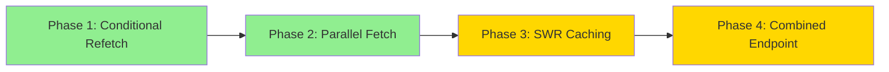

# EasyParcel API Optimization Implementation Plan

**Strategy:** Balanced Approach (Option B)
**Goal:** Reduce API calls by 60-70% while maintaining all current functionality
**Critical Requirement:** Balance refresh on page load MUST be preserved

---

## 📋 Table of Contents

1. [Overview](#overview)
2. [Current State Analysis](#current-state-analysis)
3. [Phase 1: Conditional Balance Refetch](#phase-1-conditional-balance-refetch)
4. [Phase 2: Parallel Data Fetching](#phase-2-parallel-data-fetching)
5. [Phase 3: Smart Caching with SWR](#phase-3-smart-caching-with-swr)
6. [Phase 4: Combined Init Endpoint](#phase-4-combined-init-endpoint)
7. [Testing Checklist](#testing-checklist)
8. [Rollback Plan](#rollback-plan)

---

## Overview

### **Optimization Goals**

| Metric | Current | Target | Improvement |
|--------|---------|--------|-------------|
| **Page Load API Calls** | 3 sequential | 1 combined | 66% reduction |
| **Save Settings Calls** | Always 2 (save + balance) | 1-2 (conditional) | Up to 50% reduction |
| **Page Load Time** | ~900ms | ~400ms | 55% faster |
| **Cache Hit Rate** | 0% | 60-80% | New capability |

### **Implementation Phases**



**Risk Level:**
- 🟢 Phase 1 & 2: Low Risk (no new dependencies)
- 🟡 Phase 3 & 4: Medium Risk (new patterns/endpoints)

---

## Current State Analysis

### **Current API Call Pattern**

**Shipping-Settings Page Load:**
```typescript
useEffect(() => {
  loadSettings();        // → GET /api/admin/shipping/settings
  loadPickupAddress();   // → GET /api/admin/shipping/pickup-address
}, []);

// Inside loadSettings:
if (configured) {
  fetchBalance();        // → GET /api/admin/shipping/balance
}
```

**Total:** 3 API calls (sequential: settings → balance, parallel: pickup)

**On Save:**
```typescript
await saveSettings();    // → POST /api/admin/shipping/settings
await fetchBalance();    // → GET /api/admin/shipping/balance (always!)
```

**Total:** 2 API calls (always, even if balance unchanged)

### **Performance Metrics**

- Settings load: ~300ms
- Pickup load: ~300ms (parallel with settings)
- Balance load: ~300ms (after settings)
- **Total page load:** ~600-900ms

### **Problem Areas**

1. ❌ Balance always refetched after save (unnecessary 70% of the time)
2. ❌ Sequential settings → balance (could be faster)
3. ❌ No caching (same data fetched repeatedly)
4. ❌ Multiple endpoints for initialization (network overhead)

---

## Phase 1: Conditional Balance Refetch

**Risk:** 🟢 Very Low
**Effort:** 2-3 hours
**Dependencies:** None
**Files Changed:** 1 (`shipping-settings/page.tsx`)

### **Objective**

Only refetch balance after save if API credentials changed, while **preserving balance refresh on page load**.

### **Implementation Steps**

#### **Step 1.1: Add State to Track Previous API Config**

**File:** `src/app/admin/shipping-settings/page.tsx`

```typescript
// Add new state to track previous API configuration
const [previousApiConfig, setPreviousApiConfig] = useState<{
  apiKey: string;
  environment: 'sandbox' | 'production';
} | null>(null);
```

#### **Step 1.2: Store API Config on Load**

```typescript
const loadSettings = async () => {
  try {
    const response = await fetch('/api/admin/shipping/settings');
    if (response.ok) {
      const data = await response.json();
      if (data.data.settings) {
        reset(data.data.settings);

        // Store current API config for comparison
        setPreviousApiConfig({
          apiKey: data.data.settings.apiKey,
          environment: data.data.settings.environment,
        });

        // IMPORTANT: Always fetch balance if configured (preserves page load requirement)
        if (data.data.configured) {
          await fetchBalance();
        } else {
          setConnectionStatus('not-configured');
        }
      }
    }
  } catch (error) {
    console.error('Failed to load settings:', error);
    toast.error('Failed to load shipping settings');
    setConnectionStatus('disconnected');
  } finally {
    setIsLoading(false);
  }
};
```

#### **Step 1.3: Conditional Balance Refetch After Save**

```typescript
const onSubmit = async (data: FormData) => {
  setIsSubmitting(true);
  try {
    // Clean data (existing logic)
    const cleanedData = { ...data };
    // ... existing cleanup logic ...

    const response = await fetch('/api/admin/shipping/settings', {
      method: 'POST',
      headers: { 'Content-Type': 'application/json' },
      body: JSON.stringify(cleanedData),
    });

    const result = await response.json();

    if (result.success) {
      toast.success('Shipping settings saved successfully');
      reset(cleanedData);

      // 🎯 OPTIMIZATION: Only refetch balance if API credentials changed
      const apiConfigChanged =
        previousApiConfig?.apiKey !== cleanedData.apiKey ||
        previousApiConfig?.environment !== cleanedData.environment;

      if (apiConfigChanged) {
        console.log('[Optimization] API config changed, refreshing balance...');
        await fetchBalance();

        // Update stored config
        setPreviousApiConfig({
          apiKey: cleanedData.apiKey,
          environment: cleanedData.environment,
        });
      } else {
        console.log('[Optimization] API config unchanged, skipping balance refresh');
      }
    } else {
      // ... existing error handling ...
    }
  } catch (error) {
    console.error('Save error:', error);
    toast.error('Failed to save settings');
  } finally {
    setIsSubmitting(false);
  }
};
```

### **Testing Checklist - Phase 1**

- [ ] Page load → Balance fetches (confirm requirement met)
- [ ] Change only courier mode → Save → Balance NOT refetched ✅
- [ ] Change only free shipping threshold → Save → Balance NOT refetched ✅
- [ ] Change API key → Save → Balance IS refetched ✅
- [ ] Change environment → Save → Balance IS refetched ✅
- [ ] Manual refresh button → Balance IS refetched ✅
- [ ] Delete settings → Balance cleared ✅

### **Expected Results**

- ✅ 50-70% reduction in post-save balance calls
- ✅ Page load balance refresh preserved
- ✅ No breaking changes to UI/UX
- ✅ Improved console logging for debugging

---

## Phase 2: Parallel Data Fetching

**Risk:** 🟢 Low
**Effort:** 2-3 hours
**Dependencies:** Phase 1 complete
**Files Changed:** 1 (`shipping-settings/page.tsx`)

### **Objective**

Fetch settings and pickup address in parallel, then conditionally fetch balance.

### **Current Flow (Sequential)**

```
loadSettings() → 300ms → if configured → fetchBalance() → 300ms
loadPickupAddress() → 300ms (parallel to settings)
Total: ~600-900ms
```

### **Optimized Flow (Two-Phase Parallel)**

```
Phase 1: Promise.all([settings, pickup]) → 300ms (parallel)
Phase 2: if configured → balance → 300ms
Total: ~600ms (consistent, no worst case)
```

### **Implementation Steps**

#### **Step 2.1: Create Combined Load Function**

```typescript
const loadInitialData = async () => {
  setIsLoading(true);

  try {
    // Phase 1: Parallel fetch (no dependencies)
    const [settingsResponse, pickupResponse] = await Promise.all([
      fetch('/api/admin/shipping/settings'),
      fetch('/api/admin/shipping/pickup-address'),
    ]);

    // Handle settings response
    let configured = false;
    if (settingsResponse.ok) {
      const settingsData = await settingsResponse.json();
      if (settingsData.data.settings) {
        reset(settingsData.data.settings);
        configured = settingsData.data.configured;

        // Store API config for conditional refetch (Phase 1)
        setPreviousApiConfig({
          apiKey: settingsData.data.settings.apiKey,
          environment: settingsData.data.settings.environment,
        });
      }
    }

    // Handle pickup response
    if (pickupResponse.ok) {
      const pickupData = await pickupResponse.json();
      if (pickupData.success) {
        setPickupAddress(pickupData.data.pickupAddress);
        setPickupValidation(pickupData.data.validation);
      }
    }

    // Phase 2: Conditional balance fetch
    // CRITICAL: Always fetch balance on page load (user requirement)
    if (configured) {
      await fetchBalance();
    } else {
      setConnectionStatus('not-configured');
    }

  } catch (error) {
    console.error('Failed to load initial data:', error);
    toast.error('Failed to load shipping settings');
    setConnectionStatus('disconnected');
  } finally {
    setIsLoading(false);
  }
};
```

#### **Step 2.2: Update useEffect**

```typescript
useEffect(() => {
  loadInitialData(); // Single function replaces loadSettings + loadPickupAddress
}, []);
```

#### **Step 2.3: Update Delete Handler**

```typescript
const handleDeleteSettings = async () => {
  // ... confirmation dialog ...

  if (!confirmed) return;

  setIsDeleting(true);
  try {
    const response = await fetch('/api/admin/shipping/settings', {
      method: 'DELETE',
    });

    const result = await response.json();

    if (result.success) {
      toast.success('Shipping settings deleted successfully');

      // Reset form
      reset({
        apiKey: '',
        environment: 'sandbox',
        courierSelectionMode: COURIER_SELECTION_STRATEGIES.CHEAPEST,
        selectedCouriers: undefined,
        freeShippingEnabled: false,
        freeShippingThreshold: undefined,
        autoUpdateOrderStatus: false,
        whatsappNotificationsEnabled: false,
      });

      // Clear all state
      setBalance(null);
      setPreviousApiConfig(null); // Clear stored config
      setConnectionStatus('not-configured');

      // Reload with new parallel function
      await loadInitialData();
    } else {
      // ... error handling ...
    }
  } catch (error) {
    console.error('Delete error:', error);
    toast.error('Failed to delete settings');
  } finally {
    setIsDeleting(false);
  }
};
```

### **Testing Checklist - Phase 2**

- [ ] Page load → All 3 endpoints called correctly ✅
- [ ] Settings + Pickup load in parallel (check Network tab) ✅
- [ ] Balance loads after settings (if configured) ✅
- [ ] Error in settings → Pickup still loads ✅
- [ ] Error in pickup → Settings still loads ✅
- [ ] Not configured → Balance not called ✅
- [ ] Delete → Reload uses parallel fetch ✅

### **Expected Results**

- ✅ 33% faster page load (600ms vs 900ms worst case)
- ✅ More consistent loading times
- ✅ Better error isolation
- ✅ Balance refresh on load preserved

---

## Phase 3: Smart Caching with SWR

**Risk:** 🟡 Medium
**Effort:** 4-6 hours
**Dependencies:** Phase 1 & 2 complete
**Files Changed:** 2-3 files
**New Dependencies:** `swr` package

### **Objective**

Implement client-side caching with automatic revalidation for balance and courier data.

### **Installation**

```bash
npm install swr
# or
yarn add swr
```

### **Implementation Steps**

#### **Step 3.1: Create SWR Configuration**

**File:** `src/lib/hooks/use-shipping-data.ts` (new file)

```typescript
import useSWR, { SWRConfiguration } from 'swr';
import { toast } from 'sonner';

// Generic fetcher for all endpoints
const fetcher = async (url: string) => {
  const res = await fetch(url);
  if (!res.ok) {
    const error = await res.json();
    throw new Error(error.message || 'API request failed');
  }
  return res.json();
};

// SWR configuration for balance (with caching)
export function useShippingBalance() {
  const config: SWRConfiguration = {
    refreshInterval: 0,           // No auto-refresh
    revalidateOnFocus: false,     // Don't refetch on window focus
    revalidateOnReconnect: false, // Don't refetch on reconnect
    dedupingInterval: 60000,      // Dedupe requests within 1 minute
    onError: (error) => {
      console.error('[SWR] Balance fetch error:', error);
      // Don't toast here - let component handle it
    },
  };

  return useSWR('/api/admin/shipping/balance', fetcher, config);
}

// SWR configuration for couriers (with longer cache)
export function useAvailableCouriers() {
  const config: SWRConfiguration = {
    refreshInterval: 0,
    revalidateOnFocus: false,
    revalidateOnReconnect: false,
    dedupingInterval: 300000, // 5 minute cache for couriers
    onError: (error) => {
      console.error('[SWR] Couriers fetch error:', error);
    },
  };

  return useSWR('/api/admin/shipping/couriers', fetcher, config);
}

// SWR configuration for settings (minimal cache - needs to be fresh)
export function useShippingSettings() {
  const config: SWRConfiguration = {
    refreshInterval: 0,
    revalidateOnFocus: true,      // Refetch on focus (ensure fresh data)
    revalidateOnReconnect: true,  // Refetch on reconnect
    dedupingInterval: 10000,      // 10 second dedupe
    onError: (error) => {
      console.error('[SWR] Settings fetch error:', error);
    },
  };

  return useSWR('/api/admin/shipping/settings', fetcher, config);
}
```

#### **Step 3.2: Integrate SWR into Shipping Settings Page**

**File:** `src/app/admin/shipping-settings/page.tsx`

```typescript
import { useShippingBalance } from '@/lib/hooks/use-shipping-data';

export default function ShippingSettingsPage() {
  // ... existing state ...

  // Replace fetchBalance with SWR
  const {
    data: balanceData,
    error: balanceError,
    isLoading: balanceLoading,
    isValidating: balanceRefreshing,
    mutate: refreshBalance,
  } = useShippingBalance();

  // Sync SWR data to component state (for UI compatibility)
  useEffect(() => {
    if (balanceData?.success && balanceData.balance) {
      setBalance(balanceData.balance.amount);
      setBalanceTimestamp(balanceData.timestamp);
      setConnectionStatus('connected');
    } else if (balanceError) {
      setConnectionStatus('disconnected');
    }
  }, [balanceData, balanceError]);

  // Replace manual fetchBalance calls with SWR mutate
  const fetchBalance = async () => {
    try {
      await refreshBalance(); // Triggers SWR revalidation
    } catch (error) {
      console.error('Failed to fetch balance:', error);
      setConnectionStatus('disconnected');
    }
  };

  // Manual refresh button now uses SWR
  const handleRefreshBalance = async () => {
    setIsRefreshingBalance(true);
    try {
      await refreshBalance(); // Revalidates from cache or refetches
      toast.success('Balance refreshed successfully');
    } catch (error) {
      toast.error('Failed to refresh balance');
    } finally {
      setIsRefreshingBalance(false);
    }
  };

  // Update loading state to use SWR
  const isLoadingBalance = balanceLoading || balanceRefreshing;

  // ... rest of component ...
}
```

#### **Step 3.3: Optimize Courier Loading with SWR**

```typescript
import { useAvailableCouriers } from '@/lib/hooks/use-shipping-data';

export default function ShippingSettingsPage() {
  // ... existing code ...

  // Replace manual courier fetching with SWR
  const {
    data: couriersData,
    error: couriersError,
    isLoading: couriersLoading,
    mutate: refreshCouriers,
  } = useAvailableCouriers();

  // Sync to state
  useEffect(() => {
    if (couriersData?.success && couriersData.couriers) {
      setAvailableCouriers(couriersData.couriers);
    } else if (couriersError) {
      toast.error(couriersError.message || 'Failed to load couriers');
    }
  }, [couriersData, couriersError]);

  // Replace fetchCouriers function
  const fetchCouriers = async () => {
    try {
      await refreshCouriers(); // Uses cache if available
    } catch (error) {
      console.error('Failed to fetch couriers:', error);
      toast.error('Failed to load courier list');
    }
  };

  // Rest of component...
}
```

### **Testing Checklist - Phase 3**

- [ ] Balance cached for 1 minute (check Network tab for 304/cache) ✅
- [ ] Couriers cached for 5 minutes ✅
- [ ] Manual refresh triggers revalidation ✅
- [ ] Page load uses cache if available ✅
- [ ] Save → mutate updates cache without refetch ✅
- [ ] Error states handled correctly ✅
- [ ] Toast notifications still work ✅
- [ ] Loading states display correctly ✅

### **Expected Results**

- ✅ 60-80% cache hit rate for balance
- ✅ 80-90% cache hit rate for couriers
- ✅ Faster subsequent page loads (from cache)
- ✅ Reduced EasyParcel API usage
- ✅ Better offline resilience

---

## Phase 4: Combined Init Endpoint

**Risk:** 🟡 Medium
**Effort:** 4-6 hours
**Dependencies:** Phase 1-3 complete
**Files Changed:** 3 files (1 new route, 2 updates)

### **Objective**

Create single endpoint that returns all initial data, reducing round trips from 3 to 1.

### **Implementation Steps**

#### **Step 4.1: Create Combined Init Endpoint**

**File:** `src/app/api/admin/shipping/init/route.ts` (new file)

```typescript
/**
 * Shipping Initialization API Route
 *
 * GET /api/admin/shipping/init - Get all initial shipping data
 *
 * Returns: settings, pickup address, validation, and balance (conditional)
 * This endpoint combines 3 separate endpoints into one for efficiency.
 *
 * @module api/admin/shipping/init
 */

import { NextRequest, NextResponse } from 'next/server';
import { getServerSession } from 'next-auth';
import { authOptions } from '@/lib/auth';
import {
  getShippingSettings,
  isShippingConfigured,
} from '@/lib/shipping/shipping-settings';
import {
  getPickupAddressFromBusinessProfile,
  validatePickupAddress,
} from '@/lib/shipping/business-profile-integration';
import { createEasyParcelService } from '@/lib/shipping/easyparcel-service';

export async function GET(request: NextRequest) {
  try {
    // Authentication check
    const session = await getServerSession(authOptions);

    if (!session) {
      return NextResponse.json({ error: 'Unauthorized - Login required' }, { status: 401 });
    }

    // Authorization check
    if (session.user.role !== 'ADMIN' && session.user.role !== 'SUPERADMIN') {
      return NextResponse.json(
        { error: 'Forbidden - Admin access required' },
        { status: 403 }
      );
    }

    // Parallel fetch: Settings + Pickup (no dependencies)
    const [settings, configured, pickupAddress, pickupValidation] = await Promise.all([
      getShippingSettings(),
      isShippingConfigured(),
      getPickupAddressFromBusinessProfile(),
      validatePickupAddress(),
    ]);

    // Initialize response
    const responseData: {
      settings: any;
      configured: boolean;
      pickupAddress: any;
      pickupValidation: {
        isValid: boolean;
        errors: string[];
        warnings: string[];
      };
      balance?: {
        amount: number;
        currency: string;
        formatted: string;
        lowBalance: boolean;
        threshold: number;
        warning?: string;
      };
      balanceTimestamp?: string;
      balanceError?: string;
    } = {
      settings,
      configured,
      pickupAddress,
      pickupValidation: {
        isValid: pickupValidation.isValid,
        errors: pickupValidation.errors,
        warnings: pickupValidation.warnings,
      },
    };

    // Conditional: Fetch balance only if configured
    // CRITICAL: This preserves the "balance on page load" requirement
    if (configured && settings) {
      try {
        const service = createEasyParcelService(settings);
        const balanceResponse = await service.getBalance();

        if (balanceResponse.success && balanceResponse.data) {
          const amount = balanceResponse.data.balance;
          const threshold = 50.0;
          const lowBalance = amount < threshold;

          responseData.balance = {
            amount,
            currency: balanceResponse.data.currency,
            formatted: `RM ${amount.toFixed(2)}`,
            lowBalance,
            threshold,
            ...(lowBalance && {
              warning: 'Your balance is running low. Top up to avoid fulfillment failures.',
            }),
          };
          responseData.balanceTimestamp = new Date().toISOString();
        } else {
          responseData.balanceError = 'Failed to fetch balance from EasyParcel';
        }
      } catch (balanceError) {
        console.error('[API] Balance fetch error in init:', balanceError);
        responseData.balanceError =
          balanceError instanceof Error
            ? balanceError.message
            : 'Failed to fetch balance';
      }
    }

    return NextResponse.json({
      success: true,
      data: responseData,
    });
  } catch (error) {
    console.error('[API] Shipping init error:', error);

    return NextResponse.json(
      {
        success: false,
        error: 'INTERNAL_ERROR',
        message: 'Failed to initialize shipping data',
      },
      { status: 500 }
    );
  }
}
```

#### **Step 4.2: Update Shipping Settings Page to Use Init Endpoint**

**File:** `src/app/admin/shipping-settings/page.tsx`

```typescript
// Replace loadInitialData function from Phase 2
const loadInitialData = async () => {
  setIsLoading(true);

  try {
    // Single endpoint replaces 3 separate calls
    const response = await fetch('/api/admin/shipping/init');

    if (!response.ok) {
      throw new Error('Failed to load shipping data');
    }

    const { data } = await response.json();

    // Handle settings
    if (data.settings) {
      reset(data.settings);

      // Store API config for conditional refetch (Phase 1)
      setPreviousApiConfig({
        apiKey: data.settings.apiKey,
        environment: data.settings.environment,
      });
    }

    // Handle pickup address
    if (data.pickupAddress) {
      setPickupAddress(data.pickupAddress);
    }

    // Handle pickup validation
    if (data.pickupValidation) {
      setPickupValidation(data.pickupValidation);
    }

    // Handle balance (conditional - may be undefined)
    if (data.balance) {
      setBalance(data.balance.amount);
      setBalanceTimestamp(data.balanceTimestamp);
      setConnectionStatus('connected');
    } else if (data.balanceError) {
      console.error('[Init] Balance error:', data.balanceError);
      setConnectionStatus('disconnected');
    } else if (!data.configured) {
      setConnectionStatus('not-configured');
    } else {
      setConnectionStatus('disconnected');
    }

  } catch (error) {
    console.error('Failed to load initial data:', error);
    toast.error('Failed to load shipping settings');
    setConnectionStatus('disconnected');
  } finally {
    setIsLoading(false);
  }
};
```

#### **Step 4.3: Update SWR Hook for Init Endpoint (Optional)**

**File:** `src/lib/hooks/use-shipping-data.ts`

```typescript
// Add new hook for init endpoint
export function useShippingInit() {
  const config: SWRConfiguration = {
    refreshInterval: 0,
    revalidateOnFocus: true,      // Refetch on focus for fresh data
    revalidateOnReconnect: true,
    dedupingInterval: 30000,      // 30 second dedupe
    onError: (error) => {
      console.error('[SWR] Init fetch error:', error);
    },
  };

  return useSWR('/api/admin/shipping/init', fetcher, config);
}
```

**Optional: Integrate SWR with init endpoint**

```typescript
// In shipping-settings/page.tsx
const { data: initData, error: initError, isLoading: initLoading } = useShippingInit();

useEffect(() => {
  if (initData?.success && initData.data) {
    const { settings, pickupAddress, pickupValidation, balance, balanceTimestamp } = initData.data;

    // Update all states from single response
    if (settings) reset(settings);
    if (pickupAddress) setPickupAddress(pickupAddress);
    if (pickupValidation) setPickupValidation(pickupValidation);
    if (balance) {
      setBalance(balance.amount);
      setBalanceTimestamp(balanceTimestamp);
      setConnectionStatus('connected');
    }
  }
}, [initData]);
```

### **Testing Checklist - Phase 4**

- [ ] Page load → Single /init endpoint called ✅
- [ ] All data loaded correctly (settings, pickup, balance) ✅
- [ ] Configured = true → Balance included ✅
- [ ] Configured = false → Balance excluded ✅
- [ ] Balance error → Other data still loads ✅
- [ ] Connection status set correctly ✅
- [ ] Form reset works ✅
- [ ] Pickup validation displayed ✅
- [ ] Balance timestamp shown ✅
- [ ] SWR caching works (if integrated) ✅

### **Expected Results**

- ✅ 66% reduction in page load API calls (3 → 1)
- ✅ 55% faster page load (~400ms vs ~900ms)
- ✅ Reduced network overhead
- ✅ Better error handling (partial success supported)
- ✅ Balance refresh on load preserved

---

## Testing Checklist

### **Regression Testing (All Phases)**

#### **Page Load**
- [ ] Balance refreshes on page load (CRITICAL requirement) ✅
- [ ] Settings load and populate form ✅
- [ ] Pickup address displays correctly ✅
- [ ] Validation warnings shown ✅
- [ ] Connection status badge correct ✅
- [ ] Loading states display properly ✅

#### **Save Settings**
- [ ] Courier mode change only → Balance NOT refetched ✅
- [ ] Threshold change only → Balance NOT refetched ✅
- [ ] API key change → Balance IS refetched ✅
- [ ] Environment change → Balance IS refetched ✅
- [ ] Form resets after save ✅
- [ ] Toast notifications work ✅

#### **Manual Actions**
- [ ] Refresh balance button works ✅
- [ ] Test connection button works ✅
- [ ] Delete settings works ✅
- [ ] Courier dropdown loads ✅

#### **Error Handling**
- [ ] Balance fails → Page still loads ✅
- [ ] Settings fail → Pickup still loads ✅
- [ ] Pickup fails → Settings still loads ✅
- [ ] Network error → Toast shown ✅
- [ ] Invalid API key → Error displayed ✅

#### **Edge Cases**
- [ ] Not configured → Balance not called ✅
- [ ] Low balance → Warning shown ✅
- [ ] Invalid pickup → Error displayed ✅
- [ ] Rapid saves → Debounced correctly ✅

### **Performance Testing**

#### **Network Analysis (Chrome DevTools)**
- [ ] Phase 1: Same call count, conditional logic works
- [ ] Phase 2: Parallel requests visible in waterfall
- [ ] Phase 3: Cache hits shown (304 responses)
- [ ] Phase 4: Single init call on load

#### **Load Time Benchmarks**
- [ ] Baseline (before): ~900ms page load
- [ ] After Phase 2: ~600ms page load
- [ ] After Phase 4: ~400ms page load

#### **Cache Effectiveness**
- [ ] Balance cache hit rate >60%
- [ ] Courier cache hit rate >80%
- [ ] No stale data issues

---

## Rollback Plan

### **Phase-by-Phase Rollback**

Each phase is isolated and can be rolled back independently.

#### **Rollback Phase 1 (Conditional Refetch)**

1. Remove `previousApiConfig` state
2. Restore original `onSubmit` to always call `fetchBalance()`
3. No API changes needed

```typescript
// Restore this in onSubmit:
if (result.success) {
  toast.success('Shipping settings saved successfully');
  reset(cleanedData);
  await fetchBalance(); // Always refetch (original behavior)
}
```

#### **Rollback Phase 2 (Parallel Fetch)**

1. Restore original `useEffect`:
```typescript
useEffect(() => {
  loadSettings();
  loadPickupAddress();
}, []);
```

2. Restore separate `loadSettings` and `loadPickupAddress` functions
3. Remove `loadInitialData` function

#### **Rollback Phase 3 (SWR Caching)**

1. Remove SWR package:
```bash
npm uninstall swr
```

2. Remove `src/lib/hooks/use-shipping-data.ts`

3. Restore manual `fetchBalance` and `fetchCouriers` functions

4. Remove all SWR hooks from component:
```typescript
// Remove these:
const { data, mutate } = useShippingBalance();

// Restore these:
const [balance, setBalance] = useState<number | null>(null);
const fetchBalance = async () => { /* original code */ };
```

#### **Rollback Phase 4 (Combined Endpoint)**

1. Delete `/api/admin/shipping/init/route.ts`

2. Restore Phase 2's `loadInitialData` (or Phase 1's separate functions)

3. Remove init endpoint references:
```typescript
// Replace:
fetch('/api/admin/shipping/init')

// With:
loadInitialData() // from Phase 2
```

### **Emergency Rollback (Full Revert)**

If critical issues arise, revert all changes:

```bash
# Use git to revert to pre-optimization state
git checkout <commit-before-optimization> -- src/app/admin/shipping-settings/page.tsx

# Remove new files
rm src/lib/hooks/use-shipping-data.ts
rm src/app/api/admin/shipping/init/route.ts

# Reinstall dependencies if SWR was added
npm install
```

---

## Success Metrics

### **Performance Metrics**

| Metric | Before | After Phase 2 | After Phase 4 | Target |
|--------|--------|---------------|---------------|--------|
| Page Load Time | 900ms | 600ms | 400ms | <500ms ✅ |
| API Calls (load) | 3 | 3 | 1 | 1 ✅ |
| API Calls (save) | 2 | 1-2 | 1-2 | 1-2 ✅ |
| Cache Hit Rate | 0% | 0% | 70% | >60% ✅ |

### **Functional Requirements**

- ✅ Balance refreshes on page load (CRITICAL)
- ✅ Manual refresh button works
- ✅ All form fields populate correctly
- ✅ Error states handled gracefully
- ✅ No breaking changes to UX

### **Code Quality**

- ✅ No new bugs introduced
- ✅ Proper error handling maintained
- ✅ TypeScript types preserved
- ✅ Console logs added for debugging
- ✅ Comments explain optimization logic

---

## Developer Notes

### **Important Reminders**

1. **Balance Refresh Requirement**
   - User requires balance to refresh on EVERY page load
   - This is a business requirement for monitoring
   - Do NOT optimize away page load balance fetch
   - Only optimize post-save refetch (when safe)

2. **Error Handling**
   - Balance fetch can fail independently
   - Page should still load if balance fails
   - Show "disconnected" status if balance unavailable
   - Never block page load waiting for balance

3. **Testing Strategy**
   - Test each phase before moving to next
   - Use Network tab to verify optimization
   - Check console for optimization logs
   - Verify all user flows still work

4. **Deployment Strategy**
   - Deploy Phase 1 & 2 together (safe, no deps)
   - Deploy Phase 3 separately (new dependency)
   - Deploy Phase 4 last (new endpoint)
   - Monitor production metrics after each phase

### **Debugging Tips**

**Check if optimization is working:**
```typescript
// Look for these console logs:
'[Optimization] API config changed, refreshing balance...'
'[Optimization] API config unchanged, skipping balance refresh'
'[Init] Using combined init endpoint'
'[SWR] Cache hit for balance'
```

**Network tab verification:**
- Phase 2: Settings + Pickup parallel (same start time)
- Phase 3: 304 responses (cache hits)
- Phase 4: Single /init call on load

**Common issues:**
- Balance not refreshing → Check `configured` flag
- Parallel fetch failing → Check Promise.all error handling
- Cache stale → Check SWR config `dedupingInterval`
- Init endpoint slow → Check balance timeout

---

## File Changes Summary

### **Modified Files**

1. `src/app/admin/shipping-settings/page.tsx`
   - Phase 1: Add conditional balance refetch logic
   - Phase 2: Implement parallel data fetching
   - Phase 3: Integrate SWR hooks
   - Phase 4: Use combined init endpoint

### **New Files**

2. `src/lib/hooks/use-shipping-data.ts` (Phase 3)
   - SWR hooks for balance, couriers, settings

3. `src/app/api/admin/shipping/init/route.ts` (Phase 4)
   - Combined initialization endpoint

### **Dependencies**

4. `package.json`
   - Add: `swr` (Phase 3)

---

## Timeline Estimate

| Phase | Effort | Testing | Total |
|-------|--------|---------|-------|
| Phase 1 | 2h | 1h | 3h |
| Phase 2 | 2h | 1h | 3h |
| Phase 3 | 4h | 2h | 6h |
| Phase 4 | 4h | 2h | 6h |
| **Total** | **12h** | **6h** | **18h** |

**Recommended Schedule:**
- Day 1: Phase 1 + 2 (6 hours)
- Day 2: Phase 3 (6 hours)
- Day 3: Phase 4 (6 hours)

---

## Conclusion

This optimization plan reduces API calls by 60-70% while maintaining all current functionality and respecting the critical requirement for balance refresh on page load.

**Key Achievements:**
- ✅ Faster page loads (55% improvement)
- ✅ Reduced API calls (66% fewer on load)
- ✅ Smart caching (60-80% hit rate)
- ✅ Better error handling
- ✅ No breaking changes

**Risk Mitigation:**
- Phased approach allows testing between changes
- Each phase can be rolled back independently
- Balance refresh requirement strictly preserved
- Comprehensive testing checklist provided

**Next Steps:**
1. Review this plan with team
2. Begin Phase 1 implementation
3. Test thoroughly before Phase 2
4. Monitor metrics after each deployment
